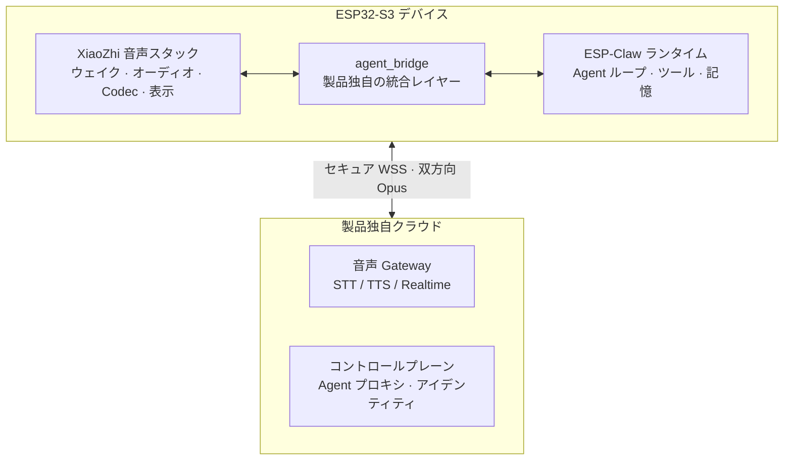

# XiaoZhi AI × ESP-Claw 製品化ブループリント

**Lumen Agent Watch — オープンソースの積み木から、量産できる腕上 AI エージェントへ**

[English](README.md) · [繁體中文](README.zh-TW.md) · [**日本語**](README.ja.md)

[実装プラットフォーム](https://github.com/jiapunk/xiaozhi-agent-platform) · [紹介サイト](https://github.com/jiapunk/lumen-watch-site) · [完全なブループリント（繁体字中国語）](xiaozhi-esp-claw-product-blueprint-v0.1.md)

---

このブループリントが答える問いは一つです。**[XiaoZhi AI（xiaozhi-esp32）](https://github.com/78/xiaozhi-esp32)の
成熟した音声スタックと、[ESP-Claw](https://github.com/espressif/esp-claw)のオンデバイス
Agent ランタイムを、どう組み合わせれば実際に量産できる腕上 AI エージェント製品になるのか？**

分析基準：`xiaozhi-esp32` commit `18a60b8`、`esp-claw` commit `9ba07d0`。

## 核心的な結論

> 統合は可能ですが、2 つの完全なアプリケーションを**直接マージすべきではありません**。

1. **製品独自の ESP-IDF アプリケーションシェルを構築する** — 起動順序、タスク、状態、
   ネットワークポリシー、セキュリティ、OTA、製品ライフサイクルの唯一の所有者とする。
2. **XiaoZhi の音声・ボードモジュールを選択的に再利用する** — 実績あるウェイクワード、
   オーディオ、Codec、表示、音声プロトコル層を抽出し、アプリシェル全体は引き継がない。
3. **ESP-Claw をオンデバイス Agent ランタイムとして採用** — Agent ループ、ツール呼び出し、
   イベントルーティング、スキル、スケジューリング、ローカルメモリ。
4. **製品独自の統合レイヤー `agent_bridge` を追加** — STT テキストを ESP-Claw へ、
   Agent の結果を TTS へ。ハードウェア能力は ESP-Claw の Capability にマッピング。
5. **製品自身の音声・デバイスクラウドを構築** — XiaoZhi の公式無料サービスは個人利用の
   位置づけであり、商用 SLA の依存先にしてはいけません。

## システムアーキテクチャ

## 3 つの統合深度

| 方式 | 説明 | 用途 |
|---|---|---|
| A. クイックデモ | クラウド Agent、デバイスは MCP で接続 | デモ / 概念実証 |
| **B. 推奨 MVP** | **オンデバイス Agent ループ、クラウド ASR/TTS/LLM** | **本製品が採用** |
| C. 上級 | 2 層 Agent（オンデバイス + クラウド） | 製品成熟後の発展形 |

## 推奨ハードウェアベースライン

| 項目 | 選択 | 理由 |
|---|---|---|
| 長期的なカスタムハードウェア | **ESP32-S3-WROOM-2-N32R16V**（32MB Flash / 16MB PSRAM） | ESP-Claw の最低要件は 8+8MB。製品はデュアル OTA・音声アセット・スキル・永続メモリが追加される |
| 最初にコンパイル可能な候補 | **ESP32-S3-BOX-3 N16R8** | 統合と実機検証の短期化のみが目的。量産資格はない |
| 未コミット | ESP32-C3 / C6 の低リソースチップ | 完全な Agent は動作不可 |

## マイルストーンの進捗

ブループリントは M0–M3 の製品化マイルストーン（アーキテクチャスパイク → Voice Agent Alpha →
Product MVP → EVT/DVT/PVT）を計画しました。実際のエンジニアリングはこれを大幅に上回り、
**実装プラットフォームは M0〜M88 の検証済みゲートを完了しています**：

| フェーズ | 内容 |
|---|---|
| 基盤 | ビルドベースライン、音声プロトコル、オーディオストリーミング、セキュアデバイス統合 |
| アイデンティティ & 接続 | 認証情報ライフサイクル、工場アイデンティティ、コントロールプレーン、Wi-Fi ライフサイクル、セキュアプロビジョニング |
| ストレージ & OTA | 署名付き A/B OTA、フリート制御、イミュータブルなファームウェアオリジン、OCI サプライチェーン |
| Agent 製品サーフェス | 有界メモリ、ランタイムオーケストレーション、物理アクション、コンテンツフリー計測 |
| 所有権 & 同意 | デバイス失効、所有権クレーム、ケイパビリティファイアウォール、正確なアクション同意 |
| リリースインフラ | 署名付き Kubernetes デプロイ、SKU ガード、工場マニフェスト、eFuse ライフサイクル |
| コンパニオン & 配信 | JIT 同意、プッシュ配信、署名付き App、mTLS ディスパッチ |
| 運用 & スケール | DB 耐障害性、分散协调、鍵ローテーション、SLO、使用量予算、サービスエンタイトルメント |

→ 実装の詳細は [xiaozhi-agent-platform](https://github.com/jiapunk/xiaozhi-agent-platform)。

## 関連リポジトリ

- 🛠️ [xiaozhi-agent-platform](https://github.com/jiapunk/xiaozhi-agent-platform) — 完全な実装（ファームウェア + Gateway + コンパニオン）
- 🌐 [lumen-watch-site](https://github.com/jiapunk/lumen-watch-site) — インタラクティブな製品紹介サイト

## ライセンス

ブループリント文書はプロジェクト自有の文書です。参照した upstream プロジェクト：
xiaozhi-esp32（MIT）、ESP-Claw（Apache-2.0）。
