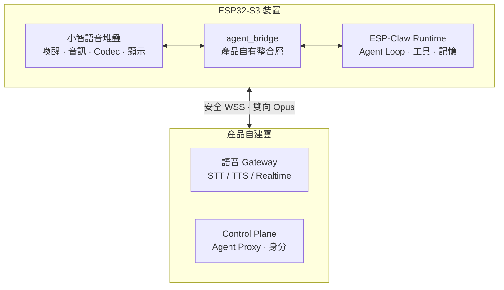

# 小智 AI × ESP-Claw 產品化藍圖

**Lumen Agent Watch — 從開源積木到可量產的腕上 AI Agent**

[實作平台](https://github.com/jiapunk/xiaozhi-agent-platform) · [體驗網站](https://github.com/jiapunk/lumen-watch-site) · [完整藍圖文件](xiaozhi-esp-claw-product-blueprint-v0.1.md)

---

這份藍圖回答一個問題：**如何把 [小智 AI（xiaozhi-esp32）](https://github.com/78/xiaozhi-esp32)的成熟語音堆疊，
與 [ESP-Claw](https://github.com/espressif/esp-claw) 的裝置端 Agent Runtime，整合成一款真正可量產的
腕上 AI Agent 產品。**

分析基準：`xiaozhi-esp32` commit `18a60b8`、`esp-claw` commit `9ba07d0`。

## 核心結論

> 整合可行，但**不應直接合併兩套完整應用**。

1. **建立產品自有的 ESP-IDF 應用主框架** — 唯一管理啟動順序、任務、狀態、網路政策、安全、OTA 與產品生命週期。
2. **選擇性重用小智的語音與板級模組** — 抽取已驗證的喚醒、音訊、Codec、顯示與語音協議，不沿用完整應用殼。
3. **ESP-Claw 作為裝置端 Agent Runtime** — Agent Loop、工具調用、事件路由、技能、排程與本機記憶。
4. **新增產品自有整合層 `agent_bridge`** — 語音層 STT 文字進入 ESP-Claw，Agent 結果送往 TTS；硬體能力映射為 ESP-Claw Capability。
5. **產品端自建語音與裝置雲** — 小智官方免費服務定位為個人使用，不應成為商用 SLA 的依賴。

## 系統架構

## 三種整合深度

| 方案 | 說明 | 適用 |
|---|---|---|
| A. 快速展示版 | 雲端 Agent，小智裝置以 MCP 接入 | Demo / 概念驗證 |
| **B. 建議 MVP** | **裝置端 Agent Loop，雲端 ASR/TTS/LLM** | **本產品採用** |
| C. 後續進階版 | 雙層 Agent（裝置端 + 雲端） | 產品成熟後演進 |

## 建議硬體基準

| 項目 | 選擇 | 原因 |
|---|---|---|
| 長期自訂硬體 | **ESP32-S3-WROOM-2-N32R16V**（32MB Flash / 16MB PSRAM） | ESP-Claw 最低需求 8+8MB；產品還需雙 OTA、語音資產、技能與持久記憶 |
| 首個可編譯候選 | **ESP32-S3-BOX-3 N16R8** | 僅用於縮短整合與真機驗證路徑，不具量產資格 |
| 暫不承諾 | ESP32-C3 / C6 低資源晶片 | 無法運行完整 Agent |

## 里程碑進度

藍圖規劃了 M0–M3 的產品化里程碑（架構 Spike → Voice Agent Alpha → Product MVP → EVT/DVT/PVT）。
實際工程推進速度遠超預期，**實作平台已完成 M0–M88 的驗證基線**：

| 階段 | 涵蓋 |
|---|---|
| 基礎建設 | 建構基線、語音協議、音訊串流、安全裝置整合 |
| 身分與連線 | 憑證生命週期、工廠身分、控制平面、Wi-Fi 生命週期、安全配網 |
| 儲存與 OTA | 簽章 A/B OTA、機隊控制、不可變韌體來源、OCI 供應鏈 |
| Agent 產品面 | 有界記憶、執行時編排、實體動作、內容隱私可觀測性 |
| 所有權與同意 | 裝置撤銷、所有權認領、能力防火牆、精確動作同意 |
| 釋出基礎設施 | 簽章 Kubernetes 部署、SKU 防護、工廠清單、eFuse 生命週期 |
| Companion 與交付 | JIT 同意、推播交付、簽章 App、mTLS 調度 |
| 營運與擴展 | 資料庫韌性、分散式協調、金鑰輪替、SLO、用量預算、服務授權 |

→ 詳細實作見 [xiaozhi-agent-platform](https://github.com/jiapunk/xiaozhi-agent-platform)。

## 藍圖文件導覽

完整文件：[`xiaozhi-esp-claw-product-blueprint-v0.1.md`](xiaozhi-esp-claw-product-blueprint-v0.1.md)

| 章節 | 內容 |
|---|---|
| [1. 結論](xiaozhi-esp-claw-product-blueprint-v0.1.md#1-結論) | 整合策略與硬體基準 |
| [2. 建議的系統邊界](xiaozhi-esp-claw-product-blueprint-v0.1.md#2-建議的系統邊界) | 韌體唯一所有權原則 |
| [3. 三種整合深度](xiaozhi-esp-claw-product-blueprint-v0.1.md#3-三種整合深度) | A / B / C 方案比較 |
| [4. 韌體整合設計](xiaozhi-esp-claw-product-blueprint-v0.1.md#4-韌體整合設計) | 引入元件、整合介面、語音協議擴充 |
| [5. MVP 參考產品](xiaozhi-esp-claw-product-blueprint-v0.1.md#5-mvp-參考產品) | 硬體基準、內建能力、驗收指標 |
| [6. 產品雲不可缺少的部分](xiaozhi-esp-claw-product-blueprint-v0.1.md#6-產品雲不可缺少的部分) | 自建雲端需求 |
| [7. 安全與法遵基線](xiaozhi-esp-claw-product-blueprint-v0.1.md#7-安全與法遵基線) | 安全設計底線 |
| [8. 授權與供應鏈](xiaozhi-esp-claw-product-blueprint-v0.1.md#8-授權與供應鏈) | 開源授權合規 |
| [9. 建議里程碑](xiaozhi-esp-claw-product-blueprint-v0.1.md#9-建議里程碑) | M0–M3 產品化時程 |
| [10. 工程 Backlog](xiaozhi-esp-claw-product-blueprint-v0.1.md#10-現在先做的工程-backlog) | 優先工作清單 |

## 相關 Repo

- 🛠️ [xiaozhi-agent-platform](https://github.com/jiapunk/xiaozhi-agent-platform) — 藍圖的完整實作（韌體 + Gateway + Companion）
- 🌐 [lumen-watch-site](https://github.com/jiapunk/lumen-watch-site) — 產品介紹與互動展示網站

## 授權

藍圖文件為專案自有文件。引用之上游專案：xiaozhi-esp32（MIT）、ESP-Claw（Apache-2.0）。
