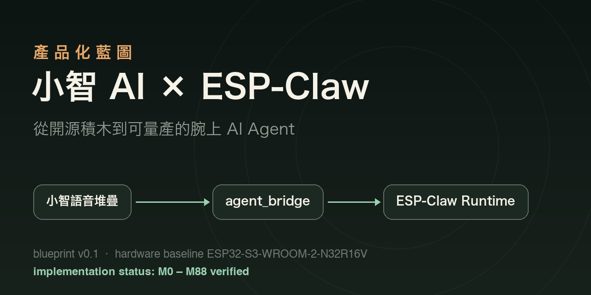
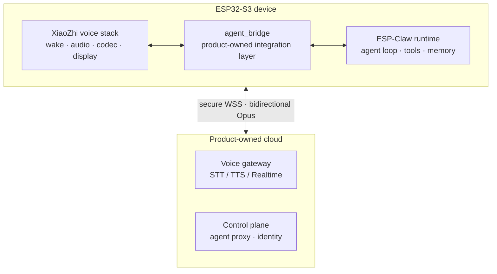

# XiaoZhi AI × ESP-Claw Product Blueprint

**Lumen Agent Watch — from open-source building blocks to a manufacturable wrist-worn AI agent**

[**English**](README.md) · [繁體中文](README.zh-TW.md) · [日本語](README.ja.md)

[Implementation platform](https://github.com/jiapunk/xiaozhi-agent-platform) · [Interactive site](https://github.com/jiapunk/lumen-watch-site) · [Full blueprint (Traditional Chinese)](xiaozhi-esp-claw-product-blueprint-v0.1.md)

---

This blueprint answers one question: **how do you combine the mature voice stack of
[XiaoZhi AI (xiaozhi-esp32)](https://github.com/78/xiaozhi-esp32) with the on-device
agent runtime of [ESP-Claw](https://github.com/espressif/esp-claw) into a wrist-worn
AI agent product that can actually be manufactured?**

Analysis baseline: `xiaozhi-esp32` commit `18a60b8`, `esp-claw` commit `9ba07d0`.

## Core conclusion

> The integration is feasible — but the two complete applications **must not be merged directly**.

1. **Build a product-owned ESP-IDF application shell** — the single owner of boot order,
   tasks, state, network policy, security, OTA and the product lifecycle.
2. **Selectively reuse XiaoZhi's voice and board modules** — extract the proven wake-word,
   audio, codec, display and voice-protocol layers; do not inherit the full app shell.
3. **ESP-Claw as the on-device agent runtime** — agent loop, tool calls, event routing,
   skills, scheduling and local memory.
4. **Add a product-owned integration layer, `agent_bridge`** — STT text flows into
   ESP-Claw, agent results flow to TTS; hardware capabilities map to ESP-Claw capabilities.
5. **Build the product's own voice and device cloud** — XiaoZhi's free official service is
   positioned for personal use and must not become a commercial SLA dependency.

## System architecture

## Three integration depths

| Option | Description | Use |
|---|---|---|
| A. Quick demo | Cloud agent, device joins via MCP | Demos / proof of concept |
| **B. Recommended MVP** | **On-device agent loop, cloud ASR/TTS/LLM** | **Chosen for this product** |
| C. Advanced | Two-tier agent (on-device + cloud) | Later evolution |

## Recommended hardware baseline

| Item | Choice | Why |
|---|---|---|
| Long-term custom hardware | **ESP32-S3-WROOM-2-N32R16V** (32 MB flash / 16 MB PSRAM) | ESP-Claw's minimum is 8+8 MB; the product adds dual OTA, voice assets, skills and persistent memory |
| First compilable candidate | **ESP32-S3-BOX-3 N16R8** | Only to shorten integration and on-hardware validation; not production qualified |
| Not committed | ESP32-C3 / C6 low-resource chips | Cannot run the full agent |

## Milestone progress

The blueprint planned product milestones M0–M3 (architecture spike → voice agent alpha →
product MVP → EVT/DVT/PVT). Actual engineering moved far faster — **the implementation
platform has completed verified gates M0 through M88**:

| Phase | Coverage |
|---|---|
| Foundation | Build baseline, voice protocol, audio streaming, secure device integration |
| Identity & connectivity | Credential lifecycle, factory identity, control plane, Wi-Fi lifecycle, secure provisioning |
| Storage & OTA | Signed A/B OTA, fleet control, immutable firmware origin, OCI supply chain |
| Agent product surface | Bounded memory, runtime orchestration, physical actions, content-private observability |
| Ownership & consent | Device revocation, ownership claim, capability firewall, exact-action consent |
| Release infrastructure | Signed Kubernetes deployment, SKU guard, factory manifests, eFuse lifecycle |
| Companion & delivery | JIT consent, push delivery, signed app, mTLS dispatch |
| Operate & scale | Database resilience, distributed coordination, key rotation, SLOs, usage budgets, entitlements |

→ Implementation detail: [xiaozhi-agent-platform](https://github.com/jiapunk/xiaozhi-agent-platform).

## Blueprint document guide

Full document (Traditional Chinese): [`xiaozhi-esp-claw-product-blueprint-v0.1.md`](xiaozhi-esp-claw-product-blueprint-v0.1.md)

| Section | Content |
|---|---|
| [1. Conclusion](xiaozhi-esp-claw-product-blueprint-v0.1.md#1-結論) | Integration strategy and hardware baseline |
| [2. System boundaries](xiaozhi-esp-claw-product-blueprint-v0.1.md#2-建議的系統邊界) | Firmware single-ownership principle |
| [3. Integration depths](xiaozhi-esp-claw-product-blueprint-v0.1.md#3-三種整合深度) | Options A / B / C compared |
| [4. Firmware integration design](xiaozhi-esp-claw-product-blueprint-v0.1.md#4-韌體整合設計) | Components, integration seams, voice protocol extensions |
| [5. MVP reference product](xiaozhi-esp-claw-product-blueprint-v0.1.md#5-mvp-參考產品) | Hardware baseline, built-in capabilities, acceptance metrics |
| [6. The product cloud](xiaozhi-esp-claw-product-blueprint-v0.1.md#6-產品雲不可缺少的部分) | Must-have cloud components |
| [7. Security & compliance baseline](xiaozhi-esp-claw-product-blueprint-v0.1.md#7-安全與法遵基線) | Security design floor |
| [8. Licensing & supply chain](xiaozhi-esp-claw-product-blueprint-v0.1.md#8-授權與供應鏈) | Open-source license compliance |
| [9. Suggested milestones](xiaozhi-esp-claw-product-blueprint-v0.1.md#9-建議里程碑) | M0–M3 productization timeline |
| [10. Engineering backlog](xiaozhi-esp-claw-product-blueprint-v0.1.md#10-現在先做的工程-backlog) | Priority work list |

## Related repositories

- 🛠️ [xiaozhi-agent-platform](https://github.com/jiapunk/xiaozhi-agent-platform) — the full implementation (firmware + gateway + companion)
- 🌐 [lumen-watch-site](https://github.com/jiapunk/lumen-watch-site) — interactive product introduction site

## License

The blueprint document is a project-owned document. Upstream projects referenced:
xiaozhi-esp32 (MIT), ESP-Claw (Apache-2.0).
