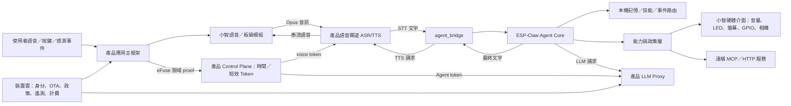

# 小智 AI × ESP-Claw 產品化藍圖 v0.1

更新日期：2026-08-11  
分析基準：`xiaozhi-esp32` commit `18a60b8051f5ee6a25beed6248ed84c7fcc742bf`；`esp-claw` commit `9ba07d013329df480e34a1a59d1513ab783d8a52`

## 1. 結論

這項整合可行，但不應直接合併兩套完整應用。建議採用：

- **建立產品自有的 ESP-IDF 應用主框架**：唯一管理啟動順序、任務、狀態、網路政策、安全、OTA 與產品生命週期。
- **選擇性重用小智的語音與板級模組**：抽取已驗證的喚醒、音訊、Codec、顯示、板級適配及語音協議，不沿用完整應用殼。
- **ESP-Claw 作為裝置端 Agent Runtime**：Agent Loop、工具調用、事件路由、技能、排程及本機記憶。
- **新增產品自有整合層 `agent_bridge`**：將語音層收到的 STT 文字送入 ESP-Claw，將 Agent 的文字結果送往 TTS；同時把硬體能力映射為 ESP-Claw Capability。
- **產品端自建語音與裝置雲**：小智官方免費服務定位在個人使用，不應成為商用 SLA 的依賴；開源社群後端也明確警告尚未通過生產環境所需的安全評估。

長期自訂硬體基準建議鎖定 **ESP32-S3-WROOM-2-N32R16V（32MB Flash、16MB PSRAM）**；
目前可編譯的首個產品候選則是 **ESP32-S3-BOX-3 N16R8**，只用於縮短整合與真機驗證
路徑，尚未取得量產資格。先不承諾 C3/C6 等低資源晶片可運行完整 Agent。ESP-Claw
官方文件列出的最低需求為 8MB Flash 與 8MB PSRAM；合併後還需要雙 OTA、語音資產、
技能與持久記憶，32/16MB 的餘裕較適合後續自訂商品硬體。

目前已沿此方向推進到 M83 工程基線：除安全 WSS、序列化語音事件、
BOX-3 雙向 Opus、request correlation 與 ESP-Claw 綁定外，亦具備設備
HMAC bootstrap proof、短效且一次性 voice token，以及到期／斷線後重建
完整執行圖的 BOX-3 supervisor；裝置端已加入嚴格 HTTPS credential
client、以 ESP32-S3 受保護 HMAC_UP eFuse 金鑰實作的限域 signer、可信
時間防護，以及雙人覆核、簽章回執與隔離政策的工廠身分流程；M9 再
加入獨立 control plane、同源 HTTPS authenticated-time／Agent-token 裝置
client，以及保留供應商主金鑰、限流並正規化請求的產品 Agent Proxy；
voice／Agent 的 proof domain、audience 與簽章金鑰均嚴格分域。
M10 進一步以 linker map 證明 ESP-IDF 顯示的 16 KiB 100% IRAM 僅是
獨立子區域，不是總 IRAM 耗盡，並建立 combined IRAM/DIRAM 自動預算門檻。
M11 已接入真正的 ESP-IDF Wi-Fi／PHY／WPA closure，建立產品自有且單一的
station 狀態機、專用 NVS blob、有限退避、錯誤憑證鎖定、實體操作配網入口，
並把 IP readiness 直接交給 BOX-3 Agent supervisor；不匯入小智完整
`WifiBoard`，也不把開放且未授權的 captive portal 當成產品預設。
M12 再於同一個 Wi-Fi owner 之上加入實體操作開窗、單客戶 WPA2 SoftAP、
Espressif 標準 `proto-ver`／Security 2／`prov-config`、限時與錯誤鎖定，
以及「取得可用 IP 後才持久化」的候選憑證回滾；工廠工具以每台受保護
HMAC 身分金鑰分域衍生 SoftAP 與 Security 2 資料，不在 NVS 保存明文密碼。
M13 再建立唯一的 `product_storage` 所有者：量產組態只接受工廠預先注入、
完整鎖定且與身分金鑰分槽的 HMAC_UP 金鑰，於執行期分域推導 XTS-AES
金鑰加密家用 Wi-Fi `nvs`；一般韌體不能生成或燒錄 eFuse，缺少／錯誤／
共用金鑰時在網路啟動前失敗關閉。工廠收據升級到 v2，綁定兩把金鑰、
配網資料回讀、Security 2 實際交易與加密 NVS 重開機測試。
M14–M16 已補上嚴格 P-256 簽章 A/B OTA、可信時間／板型／channel／
sequence／image descriptor／完整 SHA-256 驗證、首次開機健康 gate、獨立
fleet offer proof、deterministic cohort、release／image-bound OTA token，及
每次下載前重驗 immutable object 的獨立 firmware origin。M17 再把 release
registry 與 origin catalog 從同一份已驗證 release record 自動產生，固定為
唯讀、digest-bound、`READY` 最後寫入且預設停用／零 cohort 的部署 generation；
Python 與使用正式 service loader 的 Go validator 均需通過，避免營運人員在
兩份 catalog 重複輸入 release ID、路徑、size 或 hash。
M18 再把 cohort 啟用／擴大／緊急歸零／恢復改為新的 immutable generation：
request 綁定 parent receipt、release/image、前後 cohort、有效時間與外部
approver keyring hash，且必須由兩位不同操作者以不同 Ed25519 金鑰核准；
Python／Go validator 會沿完整 parent chain 回到 M17 staging，並依 receipt
選擇歷史 keyring snapshot，拒絕 sequence gap、ancestor ID 重用與 keyring 替換。
M19 再以單一 writer、不可覆寫且 fsync 的 SHA-linked/HMAC state record、
exact CAS、replica PREPARED/ACTIVE 回報、短租約與 drain fence，原子切換
control plane／firmware origin 的 serving generation；M20 則為五個 Go 服務
直接生成 amd64/arm64 OCI layout，附 subject-bound SPDX 2.3 SBOM 與
in-toto/SLSA provenance，以外部信任根 Ed25519 receipt 固定完整 graph，並由
Python／Go 獨立驗證 content address、gzip/USTAR、非 root 靜態 ELF 與唯讀佈局。
M21 再以產品自有 `nvs` owner 實作最多 8 筆、雙槽 generation/CRC 復原、
不保存 transcript 且不自動萃取的 `profile`／`preference` 記憶；ESP-Claw
只取得 exact list/get 與需產品 UI 一次性 request/session 授權的 put/forget，
所有值皆標為不可信資料，不能覆蓋系統、安全或產品政策。
M22 已把這些元件接成單一 BOX-3 產品 runtime owner，依序管理身分、control、
短效 credential、Agent supervisor、近似憑證時間、Wi-Fi 與實體操作配網，並以
嚴格反向回收及 timeout handle 重試封閉生命週期；SNTP 不會取代產品認證時間。
M23 再加入唯一的 GPIO0 低有效 Boot-button owner：先釋放再武裝、50 ms 去抖；
原始三秒長按配網契約已由 M39 升級為「放開後分類」：少於三秒無動作、三至十秒
開啟一次配網窗、十秒以上才要求恢復原廠。開機／重置時持續按住、卡鍵、短按或
clock rollback 均不能觸發；GPIO owner 本身仍沒有直接 erase／restart 權限。
BOX-3 Live 組態會拒絕未經新板型審查的 GPIO／極性變更，工廠 v2 回執亦新增
實體手勢 fixture gate；顯示／燈效、手機 App 與 GPIO 電氣／外殼仍須真機驗收。
M24 再建立產品自有的 BOX-3 量產開機安全 profile：可重現編譯只輸出
Secure Boot V2 RSA-3072 的 secure-padded 未簽輸入，三把獨立根金鑰共同簽
bootloader、App 僅由一把 active root 簽署；獨立 verifier 會鎖死 ESP-IDF／
上游 commit／六個 eFuse key block／partition／anti-rollback 契約並實際驗簽。
六個 block 固定為三個 Secure Boot digest、單一 XTS-AES-128 Flash Encryption、
NVS HMAC 與 identity HMAC；敏感 data partitions 明確加密，工廠回執升級 v4，
綁定 signing request、已簽產物驗證與每台 encrypted-flash manifest。
M25 再把私有 STT／TTS 邊界改為版本化、供應商中立的產品契約：WebSocket
upgrade、TTS 回應與可選 readiness 都必須回傳精確 contract version；每個
上行與下行 Opus packet 在送出前皆檢查 TOC、code 0–3、frame 長度／數量／
padding、mono 與精確 60 ms。這是結構與時序門檻，不取代真實解碼、語言品質、
隱私、延遲、取消、成本、長時壓測或 BOX-3 聲學驗證。
M26 再建立量產韌體的 App／bootloader 雙 SPDX 2.2 gate：所有 package 必須從
project dependency graph 可達，且兩份 linker map 的每個 archive 都必須對到
SPDX component 或明確補充紀錄。此門檻實際抓到官方 `--rem-unused` 漏列的
`esp_audio_codec` 與 `esp_audio_effects` 預編譯庫，現已綁定 Component Manager
hash、archive hash、Modified-MIT 條款與 27 份 license／notice；仍不把
`NOASSERTION`、SBOM inventory 或歷史掃描冒充法律／當日漏洞放行。
M27 再補上 M25 結構檢查與真實 codec 之間的窄缺口：以 `libopus` 產生
16 kHz STT／24 kHz TTS 的 mono 60 ms 固定測試封包，再由 hash 鎖定的
FFmpeg native Opus decoder 獨立解碼，逐一核對 960／1,440 個 sample 與
PCM hash；相同封包也必須通過 Go gateway policy。此測試仍只是合成音訊
參考基線，不代表供應商、ESP codec、麥克風、喇叭或 BOX-3 聲學已放行。
M28 再把 M25/M27 變成可對候選私有 adapter 實際執行的離線 runner：使用
核准 corpus 與事先凍結的延遲／取消門檻，驗證 STT stop/final、abort、平行
TTS 隔離、逐 packet 真實解碼與單 frame 取消；結果以受控 Ed25519 key
簽署，綁定 candidate config、實際 endpoint-set、受審 runner build、TLS trust、
corpus 與 decoder digest。
Receipt 不保存 URL、token、文字、文字 hash 或音訊，且永遠是
`production_ready: false`；本機 mock 只能取得 `TEST_HARNESS_PASS`，不能冒充供應商證據。
M29–M77 延伸完成裝置身分/owner/consent、Companion App、七服務 OCI/Kubernetes、
最終 15-domain market-release contract、工廠 SKU/eFuse 可信時間、APNs/FCM live
qualification、managed PostgreSQL、跨 Pod coordination、speech workload identity 與
managed-token rotation 契約。M78 加入固定七服務的 content-free OpenTelemetry 與
exact 28-day SLO；M79 將外部簽章 SLO 直接綁入 schema-v2 `MARKET_RELEASE_PASS`，不增加
第八服務或第十六個 evidence domain。M80 再補齊 Companion Swift package 的
`PrivacyInfo.xcprivacy`、逐檔 source manifest、SPDX 2.3、in-toto/SLSA provenance、
dependency license 與外部 Ed25519 source receipt。M81 再為 Agent Proxy 加入跨
replica／pricing-profile 的每裝置 UTC 日成本預算、provider-call 前預留、exact token
usage 結算、crash／未知計費保守入帳與專用 HMAC 假名帳本。M82 將相同的成本安全原則
延伸到 STT audio-ms 與 TTS Unicode-scalar／output-audio-ms，使用獨立 speech HMAC
domain、區塊預留、輸出時長硬上限與 committed／uncertain 對帳。M83 再把登入與商業
服務權益分離，以 account-scoped ordered entitlement、token 到期上限、402 裝置
non-retry state 及續費後重新驗證，約束 Voice／Agent 存取；簽章 Kubernetes profile
升為 v6。M84–M86 再加入 canonical signed ingestion、HSM/KMS-shaped single-delivery
adapter client 與可由獨立 Go module 匯入的 public SDK，仍維持七個 workload／44
resources。M87 將尚未決定的商業模式提升為 canonical fail-closed launch profile；M88 再依
使用者選定的「國際個人開發者」把 revision 2 固定為 Lane B：官網硬體加 cloud、公開免費／
consumption-only Companion、web billing adapter，以及 AU／CA／GB／SG／TW／US 六個 Wave 1
候選市場。這仍是 `PROPOSED`，billing、merchant entity、IdP、HSM／KMS、SDK distribution、
legal owner 與逐市場 RF／App／consumer evidence 都未選定；`--require-approved` 必須拒絕。
這尚未涵蓋真實 billing／模型／語音帳單、live
traffic 與完整 COGS。這些仍是 fail-closed 軟體／證據契約，
不是實體硬體、正式供應商、managed cloud、distribution-signed App、production 28-day
SLO、法規或完整 WORM evidence 的替代品。
最新編譯與風險證據見
[M9 Control-plane and Agent-proxy Report](xiaozhi-agent-platform/M9_CONTROL_PLANE_AGENT_PROXY_REPORT.md)
、[M10 Static Memory Budget Report](xiaozhi-agent-platform/M10_STATIC_MEMORY_BUDGET_REPORT.md)
、[M11 Product Wi-Fi Lifecycle Report](xiaozhi-agent-platform/M11_PRODUCT_WIFI_LIFECYCLE_REPORT.md)
、[M12 Secure Provisioning Report](xiaozhi-agent-platform/M12_SECURE_PROVISIONING_REPORT.md)
、[M13 Production Storage Report](xiaozhi-agent-platform/M13_PRODUCTION_STORAGE_REPORT.md)
、[M14 Signed A/B OTA Report](xiaozhi-agent-platform/M14_SIGNED_AB_OTA_REPORT.md)
、[M15 OTA Fleet Control Report](xiaozhi-agent-platform/M15_OTA_FLEET_CONTROL_REPORT.md)
、[M16 Immutable Firmware Origin Report](xiaozhi-agent-platform/M16_IMMUTABLE_FIRMWARE_ORIGIN_REPORT.md)
、[M17 OTA Deployment Bundle Report](xiaozhi-agent-platform/M17_OTA_DEPLOYMENT_BUNDLE_REPORT.md)
、[M18 OTA Rollout Generation Report](xiaozhi-agent-platform/M18_OTA_ROLLOUT_GENERATION_REPORT.md)
、[M19 Atomic Generation Publication Report](xiaozhi-agent-platform/M19_ATOMIC_GENERATION_PUBLICATION_REPORT.md)
、[M20 OCI Supply-chain Report](xiaozhi-agent-platform/M20_OCI_SUPPLY_CHAIN_REPORT.md)
、[M21 Bounded Agent Memory Report](xiaozhi-agent-platform/M21_BOUNDED_AGENT_MEMORY_REPORT.md)
、[M22 Product Runtime Orchestration Report](xiaozhi-agent-platform/M22_PRODUCT_RUNTIME_ORCHESTRATION_REPORT.md)
、[M23 Physical-action Onboarding Report](xiaozhi-agent-platform/M23_PHYSICAL_ACTION_ONBOARDING_REPORT.md)
、[M24 Production Boot-security Report](xiaozhi-agent-platform/M24_PRODUCTION_BOOT_SECURITY_REPORT.md)
、[M25 Speech-provider Conformance Report](xiaozhi-agent-platform/M25_SPEECH_PROVIDER_CONFORMANCE_REPORT.md)
、[M26 Firmware SBOM Report](xiaozhi-agent-platform/M26_FIRMWARE_SBOM_REPORT.md)
、[M27 Reference Opus Codec Report](xiaozhi-agent-platform/M27_REFERENCE_OPUS_CODEC_REPORT.md)
、[M28 Speech-adapter Qualification Report](xiaozhi-agent-platform/M28_SPEECH_ADAPTER_QUALIFICATION_REPORT.md)
、[M79 Backend-SLO Market-Release Binding Report](xiaozhi-agent-platform/M79_BACKEND_SLO_MARKET_RELEASE_BINDING_REPORT.md)
、[M80 Companion App Supply-Chain Report](xiaozhi-agent-platform/M80_COMPANION_APP_SUPPLY_CHAIN_REPORT.md)
、[M81 Agent Usage Budget Report](xiaozhi-agent-platform/M81_AGENT_USAGE_BUDGET_REPORT.md)
、[M82 Speech Usage Budget Report](xiaozhi-agent-platform/M82_SPEECH_USAGE_BUDGET_REPORT.md)
與 [M83 Service Entitlement Report](xiaozhi-agent-platform/M83_SERVICE_ENTITLEMENT_REPORT.md)。
本里程碑沒有實際燒錄任何 eFuse，也沒有接上真實語音／模型供應商，
也沒有使用量產 HSM 私鑰，尚未完成 registry push／scan／Cosign／live Kubernetes admission、真實 CDN／HSM 或真機
OTA／rollback；仍是編譯、主機契約與工廠／發佈控制基線，不是量產放行結論。

## 2. 建議的系統邊界



### 韌體唯一所有權原則

| 領域 | 唯一主控 | 不採用的重複實作 |
|---|---|---|
| 應用生命週期、任務、產品狀態 | 產品應用主框架 | 不沿用小智或 ESP-Claw 的完整應用殼 |
| 音訊、AEC、喚醒、Codec | 產品音訊介面；重用小智模組 | ESP-Claw 音訊模組首版停用 |
| 顯示、表情、LED、相機 | 產品 Board 介面；重用小智驅動 | ESP-Claw Board Manager／顯示服務首版停用 |
| Wi-Fi、連線與語音串流 | 產品網路介面；選用小智協議模組 | 不啟動兩套 Wi-Fi／連線管理器 |
| Agent Loop、工具迭代 | ESP-Claw | 小智後端 LLM 回答模式在 Agent 模式停用 |
| 技能、排程、事件、記憶 | ESP-Claw | 避免雲端與裝置端同時維護兩份真實狀態 |
| 裝置身分、OTA、政策、計費 | 產品雲 | 不依賴公共免費服務 |

## 3. 三種整合深度

### A. 快速展示版：雲端 Agent，小智裝置 MCP

沿用小智現有雲端 LLM，由雲端 Agent 透過小智裝置端 MCP 控制硬體。ESP-Claw 僅提供部分本機事件、排程或技能能力。

- 優點：最快看到語音控制成果，韌體改動最少。
- 缺點：核心決策仍在雲端，離線事件與本機記憶價值有限，不能充分體現 ESP-Claw。
- 用途：一至兩週概念驗證，不作最終架構。

### B. 建議 MVP：裝置端 Agent Loop，雲端 ASR/TTS/LLM

小智負責即時語音，ESP-Claw 在 ESP32 上組合上下文、選工具、執行工具與保存記憶；模型推理仍透過產品 LLM Proxy 完成。

- 優點：真正具備裝置端 Agent Runtime；硬體事件可主動觸發；工具和敏感資料可在本機管理。
- 缺點：需要新增 ASR-only／TTS-only 流程及中斷、超時、重試協議。
- 用途：首個可售產品。

### C. 後續進階版：雙層 Agent

裝置端 Agent 負責即時、本地、低風險任務；雲端 Agent 負責跨裝置、長任務、企業系統與高算力工作。兩者以明確的 delegation protocol／MCP 協作。

- 優點：可支援 Agent 產品家族與跨裝置協作。
- 缺點：狀態一致性、安全授權、成本及除錯複雜度最高。
- 用途：MVP 指標達標後再投入。

## 4. 韌體整合設計

### 4.1 只引入的 ESP-Claw 元件

第一階段建議引入：

- `claw_core`：Agent 請求、上下文、LLM 與工具迭代。
- `claw_cap`：能力登錄、工具 schema、統一執行入口。
- `claw_memory`：對話歷史與輕量／結構化記憶。
- `claw_skill`：技能目錄與按需啟用。
- `claw_event_router`：感測器、排程與系統事件觸發 Agent／能力。
- `claw_utils` 及上述元件的必要依賴。
- 第二階段才考慮 `cap_lua`、`cap_scheduler`、`cap_mcp_client/server`。

首版不要直接引入完整 `edge_agent` 或 `app_claw` 應用殼，避免板級、音訊、網路、檔案系統與 UI 的雙重初始化。

### 4.2 新增整合介面

`agent_bridge` 應提供：

1. `SubmitUserText(session_id, text, speaker_id)`：小智收到最終 STT 後提交 Agent request。
2. `CancelCurrentRequest(reason)`：喚醒詞打斷、按鍵取消或網路斷線時協同取消 LLM 與 TTS。
3. `OnAgentStage(stage, tool)`：將思考／工具執行狀態映射到燈效、螢幕或音效，不公開敏感推理內容。
4. `OnAgentFinal(text)`：把最終文字交給語音閘道串流 TTS。
5. `RegisterXiaozhiCapabilities()`：將現有音量、LED、顯示、GPIO、相機與產品功能包成 ESP-Claw Capability。
6. `PublishDeviceEvent(type, payload)`：讓按鍵、感測器、計時器或異常事件進入 Event Router。

### 4.3 語音協議擴充

小智現有協議已提供伺服器到裝置的 `stt`、`tts`、`llm` 與 `mcp` 訊息，但缺少「裝置 Agent 把文字交回 TTS」的標準路徑。建議新增能力協商：

```json
{
  "type": "hello",
  "features": {
    "device_agent": true,
    "asr_only": true,
    "tts_request": true,
    "agent_stage": true
  }
}
```

並新增裝置到伺服器訊息：

```json
{
  "type": "tts_request",
  "session_id": "...",
  "request_id": 42,
  "text": "Agent 的最終回答",
  "voice": "default"
}
```

伺服器仍以既有 `tts:start`、`tts:sentence_start`、Opus binary frames、`tts:stop` 回傳。協議必須加入 `request_id`，避免使用者打斷後播放到上一輪的延遲語音。

## 5. MVP 參考產品

建議第一個商品不是泛用智慧音箱，而是 **Agent Voice Control Kit／桌面控制器**：面向開發者、系統整合商與小量垂直應用客戶，讓他們用語音、事件與技能驅動 GPIO、I²C、UART、BLE 或 LAN MCP 裝置。

### 建議硬體基線

- ESP32-S3-WROOM-2-N32R16V。
- 雙麥克風或已驗證的 AEC 音訊方案、喇叭與硬體靜音開關。
- USB-C 供電與燒錄；量產版加入可靠電源、ESD 與過流保護。
- RGB 狀態燈；螢幕列為 Plus SKU，避免首版成本與 UI 複雜度過高。
- 一個使用者按鍵、一個可明確識別的錄音／隱私狀態指示。
- 可擴充 GPIO/I²C/UART 或 Grove/Qwiic 類介面。

### MVP 內建能力

- 語音問答、可中斷的串流 TTS。
- 明確確認後才寫入、可逐筆管理的有限 `profile`／`preference` 記憶；不保存 session transcript。
- 音量、LED、GPIO、裝置狀態、計時器／排程。
- 三個產品級 Skills：裝置設定、定時控制、感測事件回應。
- LAN MCP 呼叫可選，預設受權限與 allow-list 限制。
- Web／App 配網、裝置綁定、記憶管理、隱私刪除與 OTA。

### MVP 驗收指標

| 類別 | 初始門檻 |
|---|---|
| 首段回應延遲 | 安靜網路環境下，語句結束至首段語音 P50 ≤ 1.8 秒、P95 ≤ 3.5 秒 |
| 打斷 | 喚醒或按鍵打斷至停止播放 ≤ 300 ms，且舊 request 不得續播 |
| 穩定性 | 72 小時連續運行無重啟、無持續性 heap 衰退 |
| 記憶 | 雙槽斷電復原；App 可逐筆／邏輯清除；量產加密 NVS 與真機 factory-reset erase 另行驗證 |
| OTA | A/B OTA、首次啟動自檢、失敗自動 rollback |
| 安全 | 無長效模型主金鑰存於裝置；能力需分級、敏感操作需確認 |
| 成本 | 每裝置／每活躍日可計量 ASR、TTS、LLM token 與失敗重試成本 |

## 6. 產品雲不可缺少的部分

開源後端可作原型參考，但商用品至少需要：

- 每台裝置唯一身分、出廠憑證、綁定與撤銷。
- 短效存取權杖；LLM／ASR／TTS 供應商主金鑰只存在伺服器端。
- 模型代理、供應商切換、配額、內容政策、重試與熔斷。
- 分批 OTA、簽章、回滾、版本相容矩陣與裝置健康監控。
- 能力 allow-list、使用者確認、審計紀錄及遠端停用開關。
- 匿名化遙測、明確 opt-in、資料匯出與刪除流程。
- 每 SKU、韌體、模型、區域的成本與品質儀表板。

## 7. 安全與法遵基線

- 啟用 Secure Boot V2、Flash Encryption、簽章 HTTPS OTA、A/B rollback 與 security-version anti-rollback。
- 生產金鑰與開發金鑰分離；eFuse 燒錄需設站控、雙人覆核及可追溯記錄。
- Agent 能力分為：只讀、自動低風險、需確認、禁止遠端四級。
- 韌體下載技能／Lua 前需驗簽；設定 CPU、記憶體、檔案路徑、網路目的地及執行時間限制。
- 麥克風狀態必須有不可被軟體誤導的清楚指示；建議加入硬體靜音。
- 上市區域確認無線、電氣、材料、隱私及兒童／醫療等情境法規；法規清單需依目標市場另行建立。

## 8. 授權與供應鏈

- `xiaozhi-esp32` 為 MIT；`esp-claw` 為 Apache-2.0，兩者原則上皆可商用及修改。
- 發佈物需保留 MIT 版權與授權文字；Apache-2.0 修改檔案要標示變更，並保留適用的版權、專利與 attribution notice。
- 這只涵蓋兩個頂層專案；必須對 ESP-IDF managed components、音訊 codec、字型、圖像、喚醒詞、Lua 元件、模型與資料集另做 SBOM／授權掃描。
- 「小智」、「ESP-Claw」與 Espressif 品牌使用不等同於程式碼授權，商品名稱、Logo 與行銷文案應另做商標審查。

## 9. 建議里程碑

### M0：架構 Spike（1–2 週）

- 建立產品自有主程式＋最小 ESP-Claw Core，硬體目標為 N32R16V。
- 文字 Console → Agent → LED/GPIO capability 跑通。
- 記錄 binary size、IRAM/DRAM/PSRAM、最大 heap、任務 stack 及冷啟時間。
- 通過條件：無板級／音訊雙初始化；連續 100 輪工具調用無明顯 memory leak。

目前已完成主程式骨架、靜態連結／容量量測、`agent_bridge`、安全 WSS、
語音協議、BOX-3 音訊資料路徑、裝置 credential client、受保護 eFuse
HMAC identity、可信時間防護、獨立 control plane、產品 Agent Proxy、
工廠 v3 回執驗證、量產 NVS 加密路徑、三根外部 Secure Boot 簽章契約、
Flash Encryption／anti-rollback 組態、簽章 A/B OTA、灰度 fleet offer／短效下載
token 垂直切片、有限 Agent memory 與 BOX-3 產品啟動編排器；開發板上的
真實 Live Agent、實際 eFuse 工站執行、峰值記憶體、stack、冷啟與 100 輪／
長時測試仍待完成。

### M1：Voice Agent Alpha（2–4 週）

- ASR-only → Agent → TTS-request 全鏈路。
- 打斷、取消、超時、重連與 request correlation。
- 三個內建能力與一個事件觸發工作流。

### M2：Product MVP（4–8 週）

- 裝置綁定、短效 token、記憶管理、能力授權、遙測、A/B OTA。
- 10–30 台 alpha fleet；執行延遲、崩潰、耗用與成本測試。

### M3：EVT → DVT → PVT

- EVT：聲學、電源、熱、RF、ESD 與治具設計。
- DVT：可靠性、預掃認證、量產測試覆蓋及封閉 beta。
- PVT：供應鏈凍結、金鑰注入、追溯、灰度 OTA 與客服流程。

## 10. 現在先做的工程 Backlog

已完成的底座：固定兩個上游 commit、ESP-IDF 6.0.2、N32R16V 與 BOX-3
variants、A/B partitions、最小 ESP-Claw runtime、Agent bridge、Device
Agent v1、參考語音閘道、安全 ESP WSS、雙向 Opus、BOX-3 composition
root、參考 voice-token 簽發控制面、credential/reconnect supervisor，及
ESP HTTPS `/v1/session` client；另已完成 `agent_device_identity`、可信時間
guard、同源 `/v1/time`／`/v1/agent-token` client、獨立 control plane、
產品 Agent Proxy、工廠身分 runbook、嚴格回執 schema 與 Ed25519 回執
驗證器；M11 再加入產品自有 Wi-Fi station／重試／持久化狀態機、
Agent-supervisor readiness adapter、雙板型 clean build 與更新後靜態記憶體門檻；
M12 已加入實體操作開窗、WPA2 SoftAP、Security 2、候選憑證驗證／回滾、
每台工廠 onboarding bundle 與再次通過的雙板型 clean build；M13 已加入
唯一 NVS 初始化所有者、獨立 HMAC eFuse 金鑰組態、禁止執行期自動燒錄、
工廠雙金鑰工具／runbook／v2 簽章收據，以及開發／量產四組編譯驗證；
M14 已加入嚴格 P-256 發佈 manifest、可信時間／板型／channel／sequence 政策、
同源 HTTPS 映像 descriptor／完整 SHA-256 驗證、明確首次開機健康確認與回滾 API、
離線 signer／獨立 verifier／發佈 runbook，以及再次通過的四組 clean build；
M15 已加入獨立 OTA offer proof、註冊板型／channel 綁定、嚴格簽章 release registry、
deterministic basis-point cohort、release／image SHA-256 綁定的 OTA audience token、
ESP HTTPS offer client、撤回／重放／跨 audience／跨物件測試與四組韌體驗證；
M16 再加入獨立 firmware origin、嚴格 immutable-object catalog、相對路徑／symlink
邊界、每次下載前完整 hash、禁止 Range／conditional／redirect、每裝置單一 stream、
control-plane token 到精確 image bytes 的端到端測試與 static Linux build；
M17 再加入單一 fail-closed deployment bundle、canonical receipt／`READY`、
兩份 catalog 自動生成、輸出不可覆寫、唯讀 exact layout、Python／Go 雙驗證，
並封住 OTA registry 絕對路徑／traversal／symlink escape；M18 已加入外部
Ed25519 approver keyring、雙人 request approval、不可變 rollout generation、
EXPAND／EMERGENCY_STOP／RESUME 狀態政策與完整 lineage 驗證；M19 再加入
fsync、SHA-linked、HMAC 驗證的 append-only generation state、不可覆寫 record
commit、可修復 atomic `CURRENT`、active CAS、每個 control／origin replica 的
PREPARED／ACTIVE 回報、短租約 drain fence、雙服務 fail-closed gate，以及 Go／
獨立 Python state-chain 驗證。
M20 已加入五個 Go 服務的雙架構 deterministic OCI、SPDX／provenance 與
離線雙驗證；M21 已加入產品自有有限 Agent memory、雙槽復原、一次性
request/session consent、資料政策、兩組 C host suite、六組 policy test 與
開發／量產四組韌體編譯／靜態記憶體 gate。
M22 再加入 `box3_product_runtime`：依序擁有 identity、可信 control client、
短效 credential client、supervisor、近似時間 bootstrap、Wi-Fi 與 provisioning，
錯誤時嚴格反向回收，timeout 保留 handle 供重試；`app_main` 以 base MAC 產生固定
registry ID、以硬體 RNG 產生每次開機 client ID，release authority 為非祕密組態，
配網只接受一次性實體操作授權。SNTP 僅使 TLS 憑證時間可驗證，受保護 proof time
仍只接受產品控制面的認證回應。一般映像預設關閉 Live runtime，另有
secure-storage＋`.invalid` authority 的不可燒錄 compile gate，避免只驗證死程式碼。
M23 再把 BOX-3 GPIO0 低有效 Boot button 納入第八個 runtime resource：由產品
自有 polling task 執行 release-before-arm 與去抖，原始三秒單一配網動作在 M39
升級為放開後的配網／reset 雙門檻；工廠回執仍要求實體 fixture 證明開機按住
不觸發，並須擴充驗證兩個門檻只產生各自唯一動作。
M24 再加入可重現且不持有私鑰的 production-security build gate、三把 RSA-3072
根金鑰的 bootloader 3/3 與 App 1/1 外部簽章／獨立驗證、六個 ESP32-S3 eFuse
key block 固定配置、XTS-AES-128 release-mode Flash Encryption、16-step 真實
anti-rollback、secure download，以及工廠 v3 回執與不可逆操作 runbook。
M25 再加入 STT／TTS 私有服務的精確版本協商、strict health contract、Opus
packet 結構／mono／60 ms fail-closed gate，以及不把結構驗證冒充真實解碼的
供應商驗收 runbook。
M26 再加入 App／bootloader 雙 SPDX、dependency reachability、linker-map
archive 對照、兩個預編譯音訊庫補充清單、27 份授權文字與 canonical
receipt／`READY`，補齊 M20 未涵蓋 ESP 韌體的供應鏈 inventory。
M27 再加入可重現的雙向 Opus golden fixtures、精確 FFmpeg binary hash、
`libopus` encode／FFmpeg native decode 的交叉實作驗證、decoded sample／PCM
hash gate，以及讓 Go packet policy 直接讀取同一份 fixture manifest。
M28 再加入實際 candidate endpoint runner、核准 corpus schema、明確 latency
threshold、平行 TTS output 隔離、STT/TTS cancellation、buffered-frame fail-closed
修正，以及 transcript/audio/endpoint-free 的 Ed25519 signed receipt／獨立 verifier。
M29 再把一次性載入的裝置 JSON registry 升級為 purpose-bound Ed25519 signed
snapshot：gateway 只接收不含 bootstrap secret 的 `access` view，獨立 control plane
只接收具 proof material 的 `proof` view；兩者都有 monotonic revision、外部 restart
floor、最長 24 小時有效期、atomic hot reload、rollback／同 revision equivocation
拒絕與到期 fail-closed。gateway 在連線註冊時再做一次身份檢查，並於撤銷／到期
主動以 WebSocket policy close 終止既有 session；token mint 與 identity activation
亦有明確線性化順序。這是單機 signed-file reference，不等同 HA identity service。
M30 再把同一份 secret-free `access` view 接到 Agent Proxy 與 firmware origin：
撤銷前簽發、仍未到期的 Agent／OTA token 在新 revision 啟用後也會被 downstream
拒絕；共用 request lease tracker 封住 admission／reconcile race，Agent 撤銷會取消
實際 outbound provider request context、關閉仍在上傳的 request body 並截止回應寫入；
韌體撤銷會設定 HTTP write deadline 並停止 context-aware exact-byte stream。到期
snapshot 同樣使兩服務 readiness fail-closed。
M31 再加入四服務共用的遠端 identity source client：正式遠端模式強制專用 CA
雙向 TLS、獨立 Ed25519 snapshot trust、同步啟動取得、強 ETag conditional fetch、
精確 media type／length／revision 一致性與無 HTTP／ambient proxy 降級；三個 access
consumer 與一個 proof consumer 已在 ephemeral PKI/race harness 中收斂到同一較高
fleet revision。這仍是 client／protocol 的單機證據，不等同受管服務或跨區 HA。
M32 再加入產品自有 Swift Companion App onboarding core：只接受工廠 canonical
七欄 QR、一次性並清除自有 buffer 的標籤／Wi-Fi ticket、五分鐘／鎖定／取消／
stale callback 狀態機，且加入 Wi-Fi 只算 `networkJoined`，必須由認證產品服務
另行確認 online 才成功。iOS 傳輸鎖定官方 ESPProvision 3.1.0 的 SoftAP／
Security 2、強制關閉上游敏感 log、30／120 秒界限與取消；依賴 commit、Apache-2.0
license bytes、Security 2 IV 修正與 Swift race gate 已自動化。這仍不是已簽章 App、
完整 UI、帳號綁定、Android 或 iPhone／BOX-3 真機證據。
M33 再把抽象 online hook 收斂為 App＋裝置雙證據的 ownership claim：每次實體
配網窗產生新的 256-bit claim，只在 Security 2 的 `xz-claim` endpoint 披露；
已登入 App 必須先以獨立 Companion bearer 登記意圖，裝置上網後再用新的 eFuse
HMAC domain 確認同一 claim。控制面只存 domain-separated digest，以原子操作建立
不可被另一使用者覆寫的 owner；未綁定裝置即使 hardware proof 有效也拿不到
voice／Agent token。Swift 只接受同 flow、同 request ID／device ID 的 `bound`，
`networkJoined` 仍不是成功。內建 ownership store 明確限開發，正式環境需實作
durable serializable multi-replica adapter；帳號 IdP、owner-aware downstream token、
Wi-Fi／cloud 跨系統 power-loss recovery、UI／簽章 App 與真機證據仍未完成。
M34 已補上韌體端的 power-loss recovery：候選 Wi-Fi 與同一實體窗的 pending
claim 以單一 versioned／CRC-checked `network_state` blob 寫入產品加密 NVS；重啟
連網後由獨立 provisioning worker 以原裝置 HMAC proof 冪等確認，精確 `bound`
後才以 exact-claim compare 清除。transport、408／429／5xx 以兩秒下限重試，
redirect／其他 3xx／4xx 則 exact-match abandon 並要求新的實體配網窗。host 狀態機、
policy、BOX-3 ESP-IDF build 與 memory gate 已通過；真機 brownout／flash fault matrix、
若產品要求的雙 Wi-Fi rollback、正式 IdP／durable store 與 owner-aware 下游授權仍是 Gate。
M35 已補上 owner-aware 下游授權：control plane 每次簽發前必須解析明確的
tenant＋owner＋device 綁定，Voice／Agent 只接受帶 canonical owner／tenant／device／
JTI 的 v2 token，舊 ownerless v1 直接 fail closed。Voice replay 與 Agent admission
使用 `tenant\0owner\0device` 內部 scope；Voice session 雖保留產品內部 owner／tenant
供政策判斷，但 STT 與模型 provider 邊界都有 non-disclosure 測試。無 ownership
resolver 的 standalone session issuer 已停用。全部 Go package 與七組跨層 policy
test 通過；正式 IdP、durable multi-replica ownership、v1 drain／v2 cutover、transfer／
resale／reset／account deletion／memory erase 與跨區 stale-token revoke 仍是 Gate。
M36 已實作 PostgreSQL ownership adapter 與 migration：Begin／Confirm 使用
Serializable transaction 加上排序後的 device／claim-digest transaction lock，owner、
bound request 與 append-only bind audit 同 commit，expiry 由 database time 決定，raw
claim 不入庫。production DSN 強制 `sslmode=verify-full`，startup／readiness 驗證 exact
schema contract，DB failure 轉為 503。pgx v5.10.0 已固定、code／七組 policy gate 已通過，
兩 pool／32-way race 的 disposable-schema gate 已建立；但此環境沒有 PostgreSQL，故 live
gate、managed failover／PITR／load 與 immutable migration artifact 仍未取得，不可宣稱完成
durable multi-replica evidence。
M37 再把 Companion account trust 從 production shared HMAC 升級為 Ed25519
verification-only JWT：control plane 只持有最多三把 rotation public key，strict 驗證
EdDSA／typ／kid／HTTPS issuer／Companion audience／subject／explicit tenant／TTL／JTI，
並拒絕 noncanonical Base64URL、unknown／duplicate／trailing JSON 與任何 device/service
claim。舊 HMAC 只限 insecure development；auth／control integration 與七組 policy test
已通過。這仍不是已部署的 IdP／account service，OIDC exchange、membership、MFA／
passkey／recovery、KMS/HSM、hot reload／emergency revoke、App attestation 與多區 rollout
仍是 Gate。
M38 再把永久不可轉移的 owner 關係升級為可產品化的 binding lifecycle：初次綁定
建立 opaque binding ID／revision 1，現任 owner 必須經 account service step-up 後取得
exact-device `device:release` Ed25519 JWT，Serializable release 將狀態改為 released／
revision 2；新持有人仍需實體 Security 2 視窗與既有 App＋device 雙證據，成功後以
新 binding ID 進入 revision 3。Voice／Agent v3 token 綁定該 epoch，兩個 downstream
都查詢 live owner；Agent 下一請求即拒絕 stale token，Gateway 每五秒 reconcile 並
主動關閉舊 WebSocket。韌體 XAM2 把有限 memory 綁到同一 epoch，未綁定時鎖定、
較高 revision 原子清空、rollback／equivocation fail closed，XAM1 舊值完整驗證後
一律丟棄。Companion core 已有 exact release client；但 managed IdP step-up、完整 UI／
簽章 App、live PostgreSQL、真機 reset／resale／power-cut 與 account deletion 仍是 Gate。
M39 再補上本機恢復原廠：GPIO0 只在使用者放開後分類，三至十秒仍是配網，十秒
以上才先 commit CRC-checked `XFR1` reset intent 再重啟。下一次 boot 在開啟 Agent
memory、Wi-Fi 或 ESP-Claw 前，依 `PREPARED`／`WIFI_CLEARED`／`MEMORY_CLEARED`
三階段各自 commit，清除 `prod_wifi` 與兩個 `agent_mem` slot，最後才移除日誌；
所有斷電邊界皆可冪等重做。此流程刻意保留 `nvs_factory`、eFuse identity、Secure
Boot／Flash Encryption／OTA 狀態，也不會解除雲端 owner；正常轉售仍須先做 account
step-up release。24 組 C host、19 組 focused policy 與 BOX-3 ESP-IDF 6.0.2 compile
已通過，但 GPIO 電氣、flash remnant、brownout、App UI／IdP、live PostgreSQL 與真機
轉售仍是 Gate。
M40 再把這個真機 Gate 變成不可略過的發行條件：`xz-reset-hardware-qualification-v1`
要求獨立實驗室以 Ed25519 簽署 exact image／hardware revision 的手勢、六個斷電邊界、
至少三台不同實體樣本、每台至少 100 次且累計至少 1,000 次 reset，以及 identity／
`nvs_factory`／eFuse pre-post 不變、Wi-Fi／Agent memory raw state 消失與 boot security
保留。P-256 OTA signer 驗證受信 lab key／key ID 後，把 receipt SHA-256 簽進 manifest
v2；ESP32 與 Gateway 共同拒絕 v1／缺失摘要。測試用合成 receipt 只證明契約，專案仍
沒有真機 PASS 或 WORM lab evidence，因此不構成出貨資格。
M41 把 Agent tool catalog 收斂為產品持有的 capability firewall：read-only 狀態與可逆
動作用不同 visibility group，closed enum／SKU bitmask 決定可見範圍，callback 仍二次驗證
root Agent、request／session、exact input、adapter 與政策。有副作用的
`device.set_indicator` 必須消耗 request/session-bound 單次可信 UI grant；語音文字不能當
consent。裝置與有限 memory 操作只送 metadata-only audit，首發 BOX-3 profile 僅開放真實
adapter 的 `device.get_status`；filesystem、shell、任意 HTTP、MCP、Lua、reset／OTA／owner
操作均不對模型註冊。25 組 C host、20 組 focused policy 與 BOX-3 compile 已通過，但實體
UI／LED、telemetry retention、滲透與真機 abuse 證據仍是 Gate。
M42 發現並關閉上游 observability 的內容洩漏：固定 ESP-Claw commit 後套用 SHA-256 鎖定
patch，completion、tool arguments/results、reasoning 只留下狀態／名稱／長度，provider
error body 直接丟棄；full LLM request logging 會編譯失敗，Live profile 也拒絕 verbose
stage。產品 callback 不再逐筆寫 log，只保留 closed capability/decision 的單調飽和計數器，
不保存 request/session/內容。SBOM v2 另把同一份 patch 納入 `sources/`、receipt、上游鎖檔
與第三方聲明，並以當前源碼重建 production-security 遠端簽章候選。26 組 C host、28 組
focused policy 與 BOX-3 compile 已通過，完整回歸另通過 24 組工廠、201 組
tooling/policy、Companion 與全部 Go tests/vet/race；
但真機序列埠／crash dump/JTAG 掃描、正式 telemetry retention、滲透與 privacy review
仍是 Gate。
M43 修正 state-changing consent 的時序與綁定：`device.set_indicator` 先完成 exact
`{on: bool}` 驗證，才把 typed action 交給可信 App／實體 UI callback，並在 adapter 前
消耗 request／session／精確 argument-bound grant；語音文字不再能預發未知動作權限。
Companion core 與 control plane 加入最長 30 秒、device／owner revision／session／request／
capability／argument 全綁定的 canonical `xz-action-consent-v1`，App 只能選 approve／deny，
後端以專用 device-bound scope、current ownership 與 atomic one-use state fail close。
單程序 store 僅可在 development 顯式開啟，production 會拒絕；authenticated device
challenge ingress／decision delivery、耐久化多副本 adapter、簽章 App／實體 UI 與真機
indicator 證據仍未完成，因此首發 profile 繼續停用動作 capability。詳見
[M43 Exact-action Consent Report](xiaozhi-agent-platform/M43_AGENT_ACTION_CONSENT_REPORT.md)。
M44 已補上 device challenge/result 的兩個獨立 HMAC proof domain、canonical body
digest、PostgreSQL 0002 schema 與 Serializable `Register`／`Decide`／`Consume`：三者在
同一 transaction 鎖住 current ownership row，讓 release／rebind 與 consent 共用一個
順序域。ESP-IDF client 生成 128-bit challenge，App 決策仍只能 approve／deny，device
只會得到 pending 或一次性 exact 結果；production 強制 TLS-verified PostgreSQL，reference
store 仍限 development。26 組 C host、19 組 focused policy、完整 212 組 tooling/policy、
全部 Go test／vet／race 與 BOX-3 compile 已通過；但工作區沒有 live PostgreSQL，且尚缺
產品持有的 device-to-App 收件通道、簽章 UI、runtime callback 與真機 indicator 證據，
因此 action capability 仍不可開啟。詳見
[M44 Durable Action-consent Relay Report](xiaozhi-agent-platform/M44_DURABLE_ACTION_CONSENT_RELAY_REPORT.md)。
M45 再補上產品持有的 authenticated pending inbox 與 bounded runtime callback：App
只能以綁定 exact device 的專用 scope 讀取 current owner epoch 最早的未決 challenge，
PostgreSQL `Pending` 以 Serializable transaction 鎖同一筆 ownership row，讀取不 lease／
consume；Companion core 嚴格區分 canonical 200 與空 204。BOX-3 composition 會拒絕外部
consent callback 並自行接管，總等待 20 秒、result poll 500 ms、每次 HTTPS 最多 2 秒，
所有網路／時間／timeout／取消錯誤均 fail closed；ESP-Claw 另以 canceled request ID 與
atomic action commit 封住 cancel-before-action 競態。26 組 C host、22 組 focused policy、
完整 215 組 tooling/policy、全部 Go test／vet／race、Companion 與 BOX-3 compile 已通過；
但尚無 live PostgreSQL、簽章 App UI／正式 account lifecycle 與真機 action 證據，因此
首發 profile 仍只註冊 `device.get_status`。詳見
[M45 Action-consent Inbox and Runtime Report](xiaozhi-agent-platform/M45_ACTION_CONSENT_INBOX_RUNTIME_REPORT.md)。
M46 已把 pending API 收斂為 foreground-only App session 與可編譯的產品 SwiftUI gate：
每次 fetch／submit 都 just-in-time 取得 exact-device access，操作後清除 bearer cache；
背景、登出、換裝置、過期、stale callback 與重複點擊都不能變成 approval，response 遺失
也不自動重送。UI 只顯示 trusted device ID、固定 indicator ON/OFF 與倒數。production
control plane 在 Ed25519 JWT 本地驗證後，另以無 proxy／redirect 的 mTLS 固定 endpoint
introspect JTI、subject、tenant、action、device 與時間；revoke 回 401，服務不可用回 503，
都不觸碰 consent。Companion warnings／25 scenarios／Thread Sanitizer、25 組 focused
policy 與全部 Go test／vet 已通過；但這仍是 UI 元件與 account protocol enforcement，
不是已簽章 App 或 live IdP/account service，因此 capability 繼續關閉。詳見
[M46 Foreground Consent and Account Authorization Report](xiaozhi-agent-platform/M46_FOREGROUND_CONSENT_ACCOUNT_AUTH_REPORT.md)。
M47 已把 M46 的 account protocol 補成可部署的 durable authorization core：JWT
只能在 adapter 已取得的 exact account revision 之 JTI 以 Serializable transaction commit
後交給 App；
logout／suspend／resume 與 introspection 都鎖同一 `(tenant, subject)` 帳號列並以資料庫
時間排序，舊 revision、撤銷、過期、欄位不符或不存在一律 inactive，資料庫故障仍 fail
closed。帳號資料庫不保存 raw JWT。private reader 啟動時驗證 schema、強制 PostgreSQL
`sslmode=verify-full` 與 server-side product-CA mTLS，真實 TLS handshake 已驗證 control-plane
client，無 workload certificate 連 handler 都到不了。IdP／MFA／passkey／recovery 仍保留為
外部 adapter，workspace 無 live PostgreSQL，故尚非帳號系統量產證據。詳見
[M47 Durable Account Authorization Report](xiaozhi-agent-platform/M47_DURABLE_ACCOUNT_AUTHORIZATION_REPORT.md)。
M48 再把 `accountauthorization` 納入不相容的 OCI release schema v2：builder 固定
六服務與 canonical 順序，Python／Go 雙 validator 拒絕 v1、子集合與換序；六服務
amd64／arm64 真實 Go build、subject-bound SPDX／provenance 與兩次逐位元一致的
完整 release graph 已通過。這仍是離線供應鏈證據，不是 registry、Cosign、admission
或 live deployment。詳見
[M48 Six-service OCI Release Report](xiaozhi-agent-platform/M48_SIX_SERVICE_OCI_RELEASE_REPORT.md)。
M49 再把受信 OCI receipt 轉成簽章、可重現的 Kubernetes deployment bundle：六個
digest-only workload、最小權限 Pod security、單 replica 安全更新、default-deny
NetworkPolicy 與 value-free external prerequisite inventory 均由 semantic validator
重新生成比對。帳號服務另分離 mTLS 9444 與只回 health/readiness 的 9080 probe，
避免用無法驗 DB 的 TCP probe。38-resource 真實 smoke 與官方 kubectl 離線解析已通過，
但未連 kube-apiserver/CNI，仍不是 live admission／rollout 證據。詳見
[M49 Signed Kubernetes Deployment Report](xiaozhi-agent-platform/M49_SIGNED_KUBERNETES_DEPLOYMENT_REPORT.md)。
M50 再由受信 M49 deployment receipt 產生獨立簽章的 admission bundle：10 個 stable-v1
ValidatingAdmissionPolicy 與 10 個 Deny+Audit Binding 封鎖六服務 Pod/controller、
Service、ServiceAccount、NetworkPolicy、ConfigMap、Secret、PVC 及 Namespace label
漂移；Fail→Ignore、Audit-only、scope escape、映像/權限/network mutation 均有拒絕
測試。20-resource 真實重建與官方 kubectl 離線解析已通過，但沒有 kube-apiserver，
因此 CEL type-check、server-side dry-run、實際 denial 與 policy-resource RBAC/audit
仍是外部 gate。詳見
[M50 Signed Kubernetes Admission Report](xiaozhi-agent-platform/M50_SIGNED_KUBERNETES_ADMISSION_REPORT.md)。
M51 已把 M50 的外部 kube-apiserver gate 實作成 live qualification contract：先鎖定
非 TOFU cluster server／kube-system UID、kubectl 與 runner hash，再要求 10 個 Policy
type-check 零 warning、7 項 positive、10 類 exact-policy denial 與 ownership-safe
cleanup，最後才簽 `LIVE_API_SERVER_PASS`；另有 crash recovery 只刪本次 annotation
ownership。10 組 fixture/競態/篡改測試已通過，但 workspace 沒有 cluster/kubeconfig，
所以目前沒有 live M51 receipt，不得把 contract GO 冒充叢集 PASS。詳見
[M51 Kubernetes Admission Live Qualification Report](xiaozhi-agent-platform/M51_KUBERNETES_ADMISSION_LIVE_QUALIFICATION_REPORT.md)。

M52 再把「可部署」與「可上市」分開：固定 14 類 production evidence，要求各領域
獨立 Ed25519 authority 對同一組 SKU／產品版本／firmware／OTA／OCI／deployment／
live qualification subject 與 WORM object digest 簽章，最後才由另一把 release key
簽出 canonical `MARKET_RELEASE_PASS`。Policy 不能刪減 evidence slot，並鎖定證據
時效、第一筆 genesis、後續 exact parent hash 與連續 sequence；13 項對抗測試與完整
回歸已通過。但 workspace 沒有量產 keys 與 14/14 外部 evidence，所以沒有建立 M52
bundle，更沒有 market-release PASS。詳見
[M52 Product Market-Release Evidence Report](xiaozhi-agent-platform/M52_PRODUCT_MARKET_RELEASE_EVIDENCE_REPORT.md)。

M53 再將 BOX-3 導向的組合提升為產品自有 SKU 契約：reference N32R16 profile 僅供
開發且禁止 Live runtime／capability；`VOICE_AGENT_KIT_BOX3` rev1 candidate 固定
ESP32-S3 N16R8、GPIO0 與唯讀 status 能力。Kconfig/CMake 拒絕 board/SKU/revision／
production-security 漂移，開機則在 storage/network 前核對可讀 SoC revision、Flash、
PSRAM，能力再與 SKU allow-list 取交集。這仍無法證明實體 PCB、Codec/GPIO 或 revision，
必須接工廠身分與真機 qualification。詳見
[M53 Product SKU Hardware Guard Report](xiaozhi-agent-platform/M53_PRODUCT_SKU_HARDWARE_GUARD_REPORT.md)
與 [Product SKU Porting Guide](xiaozhi-agent-platform/PRODUCT_SKU_PORTING_GUIDE.md)。

M54 已把工廠身分接進相同啟動鏈：BOX-3 candidate 必須以 block 5 的鎖定
`HMAC_UP` key 驗證精確 70-byte `prod_sku/manifest`，並交叉核對編譯時 SKU／rev1、
當顆 silicon revision、base MAC、factory record floor 與 manifest ID；驗證位於 secure
storage 後、reset recovery／network 前。工廠工具採不可覆寫輸出，onboarding CSV 同時
包含 Security-2 與公開 authenticated manifest，簽章回執 v4 再把 manifest digest／
subject、registry 與 runtime PASS 綁定。此 manifest 是 authenticated/reset-stable，
不是硬體不可變；同機舊 record 重放仍受 compiled floor 限制。沒有實機／eFuse／量產
工站，因此目前是軟體契約 GO，不是 factory 或 market PASS。詳見
[M54 Factory-authenticated SKU Identity Report](xiaozhi-agent-platform/M54_FACTORY_AUTHENTICATED_SKU_IDENTITY_REPORT.md)。

M55 將 runbook-only 的每台 encrypted-flash manifest 落成真實 builder／verifier：固定
transaction/device/release subject，重驗 signing request、3/3 signed bootloader、1/1
signed App、四段 address-dependent XTS ciphertext、官方 parser 的 exact factory NVS，
再比對五段 raw readback，全部成功後才原子發布不可覆寫的 `complete=true` manifest。
v4 receipt verifier 現在必須讀入該 manifest，交叉核對 device／release／Secure Boot／
SKU／NVS，而非只接受任意 64 位 digest。真實 ESP-IDF tool flow 與混料負向測試已通過，
但 readback 仍是模擬檔案複本，沒有實機或工站 PASS。詳見
[M55 Per-unit Factory Flash Manifest Report](xiaozhi-agent-platform/M55_PER_UNIT_FACTORY_FLASH_MANIFEST_REPORT.md)
與 [Factory Flash Manifest Runbook](xiaozhi-agent-platform/FACTORY_FLASH_MANIFEST_RUNBOOK.md)。

M56 再關閉 readback provenance 缺口：manifest 升級為 v2，必須綁定由外部
readback authority Ed25519 簽署的 production-factory observation。read-only 工站
capture 固定 esptool/espefuse 5.3.1、`--no-stub`、同一實體 port 與五段 exact
readback；request builder 解析前後一致的 eFuse summary，要求實際 MAC、
`SPI_BOOT_CRYPT_CNT=0b111`、Secure Boot、download manual encryption disabled、
matching secure version 與仍待最後執行的 Secure Download lock。v4 receipt verifier
必須另外取得 observation 與外部公鑰，交叉核對 signature、digest、station/key、
transaction／attempt／device／release 與所有 readback。repository flow 使用合成
capture 與不落盤的 ephemeral untrusted key，只證明契約；沒有實機 PASS。詳見
[M56 Signed Physical Flash Observation Report](xiaozhi-agent-platform/M56_SIGNED_PHYSICAL_FLASH_OBSERVATION_REPORT.md)
與 [Physical Factory Flash Readback Runbook](xiaozhi-agent-platform/FACTORY_PHYSICAL_READBACK_RUNBOOK.md)。

M57 已以釘選的真實 `espefuse 5.3.1 --virt` 執行完整六槽、六階段 eFuse
lifecycle：確認 logical slots 0–5 對應 physical blocks 4–9，secret slots 3–5
先 read/write lock、三個 Secure Boot digest 保持 readable、`RD_DIS=0x38` 後才
關閉其寫入，最後再完成 Flash Encryption、Secure Boot、anti-rollback、JTAG／
download restrictions。它也實際驗出 `DIS_DIRECT_BOOT`、`SECURE_VERSION` 與
`ENABLE_SECURITY_DOWNLOAD` 共用 write-protect group，因此 Secure Download 與 shared
lock 必須在最後同一 batch 提交。evidence 永遠固定為 `VIRTUAL_TEST_ONLY`，不能充當
真機／工廠／市場證據。詳見
[M57 Virtual eFuse Rehearsal Report](xiaozhi-agent-platform/M57_VIRTUAL_EFUSE_REHEARSAL_REPORT.md)
與 [Virtual eFuse Rehearsal Runbook](xiaozhi-agent-platform/VIRTUAL_EFUSE_REHEARSAL_RUNBOOK.md)。

M58 再把空白晶片到 M56 pre-lock readback 之間的授權缺口封閉為 canonical、
短效、雙人、單機單次的犧牲板計畫。read-only capture 要求真實 MAC、16 MB Flash、
六個 key block/purpose 全空白可讀可寫、security/protection fuses 未設定且 before/after
summary 完全一致；計畫精確綁定 production signing request、signed-artifact receipt、
三個有序 Secure Boot digests、station／fixture／calibration／attempt，並由外部
Ed25519 authority 簽章。`production_inventory_eligible=false`、
`QUARANTINE_OR_DESTROY` 與 `executor_included=false` 是不可修改的契約；repository
沒有任何 burn／flash executor。合成 current-release 流程已通過 real-tool blank
capture 與 cross-release mix rejection，但沒有實機或 production authority。詳見
[M58 Sacrificial Provisioning Authorization Report](xiaozhi-agent-platform/M58_SACRIFICIAL_PROVISIONING_AUTHORIZATION_REPORT.md)
與 [Sacrificial Provisioning Authorization Runbook](xiaozhi-agent-platform/SACRIFICIAL_PROVISIONING_AUTHORIZATION_RUNBOOK.md)。

M59 再實作 M58 尚缺的原子單次消耗：外部簽章 policy 把一個 local ledger 綁定
station／fixture／authority 與實際 filesystem device/inode，mode-0400 canonical record
以完成後的 temp file、non-overwriting hard link 與 directory fsync 發布。同一 attempt
的 16-process race 只有一個 winner，精確重放、重新簽章的跨 device reuse、policy root
複製、pre/post-link crash、mode／record tamper 均有 fail-closed 測試。policy/record
永久聲明沒有 executor、沒有 hardware touch、沒有 deletion API、不可進 production
inventory。此 gate 只支援 local single station，不冒充 multi-station／WORM／power-cut
或實機證據。詳見
[M59 Sacrificial Attempt Ledger Report](xiaozhi-agent-platform/M59_SACRIFICIAL_ATTEMPT_LEDGER_REPORT.md)
與 [Sacrificial Attempt Ledger Runbook](xiaozhi-agent-platform/SACRIFICIAL_ATTEMPT_LEDGER_RUNBOOK.md)。

M60 關閉 caller-supplied UTC 回撥風險：ledger policy v2 固定 exact HTTPS endpoint、
TLS 1.3/mTLS、CA／station certificate hashes 與獨立 Ed25519 time key fingerprint。
production consume 不再接受時間或 receipt file，而是在同一程序產生 32-byte nonce，
取得最長十秒、完整綁定 plan／ledger／attempt／device／station 的 signed receipt，
五秒 monotonic round-trip 內驗證後才發布 consumption record v2。真實 local TLS/mTLS
測試及 redirect／wrong content-type／cross-subject／wrong-pin 負向測試已通過，但沒有
production time service、HSM/KMS、nonce database 或 executor start-time 證據。詳見
[M60 Sacrificial Trusted-Time Report](xiaozhi-agent-platform/M60_SACRIFICIAL_TRUSTED_TIME_REPORT.md)
與 [Sacrificial Trusted-Time Runbook](xiaozhi-agent-platform/SACRIFICIAL_TRUSTED_TIME_RUNBOOK.md)。

M61 已補上相容的 Go time-authority core：只接受 direct TLS 1.3 mTLS 與 exact
canonical M60 request，在同一 serializable PostgreSQL transaction 取得 database
time、鎖定並驗證 station／fixture／certificate DER hash，並消耗全域唯一的 request
hash／request ID／nonce hash；提交 replay 狀態後才透過外部 Ed25519 signer interface
簽署，因此 signer failure 也不能讓 nonce 復活。Go handler 產生的 receipt 已由原本
Python M60 verifier 獨立通過。production code 不含 time-signing private key、executor
或 hardware operation；目前也沒有 HSM/KMS adapter、standalone service、live
PostgreSQL／primary-backup evidence。詳見
[M61 Factory Trusted-Time Authority Report](xiaozhi-agent-platform/M61_FACTORY_TRUSTED_TIME_AUTHORITY_REPORT.md)
與 [Factory Trusted-Time Authority Runbook](xiaozhi-agent-platform/FACTORY_TRUSTED_TIME_AUTHORITY_RUNBOOK.md)。

M62 再把 M61 core 組成獨立 `factorytimeauthority` 第七服務。provider-neutral
remote signer 只接受固定 M60 domain 與 canonical unsigned receipt，以 pinned TLS 1.3
mTLS 呼叫 exact endpoint，並用釘選 Ed25519 public key 在本機重驗回傳簽章；receipt
signing private key 不進 process／Pod。OCI schema v3 固定七服務，Kubernetes schema v2
生成 44 resources／30 value-free prerequisites，9445 station mTLS、private 9081 probe
及 database:5432／signer:443 egress 均被簽章 manifest 鎖定。七服務雙架構真實 Go build、
逐位元重建與 kubectl Kustomize offline parse 已通過；仍沒有 production HSM/KMS、live
PostgreSQL／cluster、工站憑證或實機證據。詳見
[M62 Factory Trusted-Time Service Report](xiaozhi-agent-platform/M62_FACTORY_TRUSTED_TIME_SERVICE_REPORT.md)。

M63 再關閉 remote signer 的服務端信任缺口：signer handler 除了 direct TLS 1.3 mTLS，
還釘選 authority leaf certificate DER hash，並由 read-only PostgreSQL authorizer 對
已 commit row 逐欄重驗 request／nonce／station／policy／plan／attempt／device／key／time。
HSM/KMS backend 前後各檢查一次 database time，過期簽章不會釋出；backend 回傳值再由
釘選 Ed25519 public key 本機驗證。production code 仍沒有 private signer、provider
credential、executor 或第八個 product workload；真實 TLS client/server、oracle／expiry
負向測試與七服務雙架構重建皆通過。詳見
[M63 Factory Trusted-Time Signer Enforcement Report](xiaozhi-agent-platform/M63_FACTORY_TRUSTED_TIME_SIGNER_ENFORCEMENT_REPORT.md)
與 [Factory Trusted-Time Signer Runbook](xiaozhi-agent-platform/FACTORY_TRUSTED_TIME_SIGNER_RUNBOOK.md)。

M64 回到首發產品價值鏈，完成第一個可見的真實 Agent action adapter。
`VOICE_AGENT_KIT_BOX3` SKU 現在凍結 GPIO 47 active-high 螢幕背光與
`device.set_indicator` action allowlist；產品 adapter 只接受 typed boolean，建立時先關閉、
釋放前也先關閉，`device.get_status` 僅回傳有界狀態。開發用 `.example.invalid` Live
compile profile 會把 action 放入 tool catalog，仍需完整 App／control-plane exact-action
單次 consent；production-security profile 明確關閉，CMake 也拒絕誤開。這是軟體與編譯
基線；最終 ELF gate 已證明開發版包含完整 adapter，而量產版沒有任何相關 symbol。開發
映像為 1,417,088 bytes，量產 unsigned Secure-Boot padded input 為 1,441,792 bytes；完整
回歸通過 27 個 C host suites、70 個 factory tests、314 個 tooling/policy tests、Companion
gates 與 Go tests/vet。仍沒有真機背光、簽章 App、live account/PostgreSQL 或
market-release evidence。詳見
[M64 BOX-3 Visible Agent Action Report](xiaozhi-agent-platform/M64_BOX3_VISIBLE_AGENT_ACTION_REPORT.md)。

M65 補上 Companion 前景 consent 到帳號發行的實際軟體鏈。App 現在以 fixed HTTPS
contract，用每次 fresh 的產品登入 session 換取 exact device-bound、最長五分鐘的
`device:action-consent` token，操作後立即清除 session ticket；scene-aware SwiftUI gate
會在背景、登出、換裝置或 ownership revision 變更時撤銷舊 prompt。帳號端 BFF handler
只在 selected-IdP adapter 完成 session／MFA-risk／exact ownership 驗證，且 durable JTI
commit 成功後才回 bearer；handler 沒有掛入 private introspection reader。此階段仍未
選定 IdP、部署 BFF／managed DB 或產出簽章 App。詳見
[M65 Companion JIT Consent Access Report](xiaozhi-agent-platform/M65_COMPANION_JIT_CONSENT_ACCESS_REPORT.md)。

M66 加入 content-free wake-only notification boundary，但不把 consent 放進推播。
challenge 與 wake outbox 在同一 serializable PostgreSQL transaction 建立；worker 以
database time、`FOR UPDATE SKIP LOCKED`、短 lease 與 bounded retry 派送固定
`{"version":1,"kind":"action-consent-wake"}`。payload 不含裝置、動作、參數、decision、
URL 或 token；App 只有 active foreground 才把 exact signal 轉成一次新的 JIT-authenticated
inbox fetch，背景收件不發網路請求。這一階段沒有選定 APNs／FCM、installation registry、
部署 notifier、簽章 App 或 live PostgreSQL 證據。詳見
[M66 Wake-Only Notification Report](xiaozhi-agent-platform/M66_WAKE_ONLY_NOTIFICATION_REPORT.md)。

M67 再完成加密 installation registry 與具體 APNs／FCM delivery software。App 以每次
fresh IdP session 註冊／移除 installation；raw token 先以 binding-aware AES-256-GCM
加密，另用不同 HMAC key 產生 CAS digest。account revision 旋轉會原子清除舊
installation；APNs 410/Unregistered 與 typed FCM UNREGISTERED 只刪 exact current digest，
其他錯誤保留 outbox retry。private mTLS seam 維持七服務拓撲，但正式 provider credential、
mounted workload、signed App 與 live delivery 尚未完成。詳見
[M67 APNs/FCM Push Delivery Software Report](xiaozhi-agent-platform/M67_PUSH_DELIVERY_SOFTWARE_REPORT.md)。

M68 將 wake dispatch 收斂到既有七服務拓撲：`controlplane` 持有 durable outbox，
`accountauthorization` 持有 installation registry 與 APNs／FCM provider delivery，兩者
只透過 exact private mTLS contract 連接，沒有新增第八個 notifier workload；Kubernetes
Secret projection、NetworkPolicy、OCI graph 與 admission policy 都固定此邊界。

M69 建立真實 APNs／FCM provider API qualification runner：current／next credential、
永久無效 target 與取消請求都必須通過，canonical receipt 由獨立 Ed25519 authority
簽章；本機 fixture 不可升格成 `LIVE_PROVIDER_API_PASS`。M70 再加入 signed iOS App
background content-free wake、foreground authenticated fetch 與 Apple App Attest／
signed-artifact authority，final verifier 會重建整個 M69/M70 bundle。本工作區沒有 provider
credential、簽章 App 或 iPhone，因此只完成軟體 gate。

M71 從目標 `controlplane` Pod 使用既有 production client 驗證到
`accountauthorization` 的 TLS 1.3／HTTP/2 private wake，同時要求 current／next workload
certificate accepted、anonymous／revoked／wrong-hostname rejected，並由 cluster authority
綁定 exact seven-service deployment、live admission、mounted identity、NetworkPolicy 與
WORM evidence。Fixture 只能產生 `FIXTURE_MTLS_DISPATCH_PASS`。

M72 再把舊 provider credential 撤銷變成可執行 gate：固定 active accepted → revoked
明確認證拒絕 → fresh active accepted；APNs 只接受 403 `InvalidProviderToken`，FCM 必須
以 fresh OAuth token source 收到 `invalid_grant`／`invalid_client`，網路、quota、5xx 或
invalid installation 都不能冒充撤銷。獨立 provider-console audit authority 綁定
credential IDs、SPKI digests、change window 與 WORM evidence，final builder／verifier 由
strict public manifest 重建 M69→M72 全鏈。這裡只有
`FIXTURE_PROVIDER_CREDENTIAL_REVOCATION_PASS`；即使取得 live M72，仍需
`managed_database_failover`，市場結論維持 NO-GO。詳見
[M72 Provider Credential Revocation Report](xiaozhi-agent-platform/M72_PROVIDER_CREDENTIAL_REVOCATION_REPORT.md)。

M73 將最後一個軟體資格缺口具體化為三個 exact PostgreSQL role 的可執行 gate：
`ownership`、`accountauthorization`、`factorytimeauthority` 各使用 append-only、
idempotent canary ledger；提交回覆遺失時以相同 sequence/payload 重試並 exact reread，
單純斷線不能冒充 failover，必須看到新 primary node binding 且所有已確認事件仍存在。
Runner 先建立 `restore-marker`／`restore-exclusion` 的 database-time PITR window；隔離還原
只能含 `pre + restore-marker`，任何 exclusion／heartbeat／post 都失敗。獨立 managed
PostgreSQL audit authority 再綁定 control-plane failover、backup／restore operation IDs、
encryption、isolation、RPO／RTO 與 WORM。Final verifier 會重建 M69→M73 全鏈。
本工作區只取得 `FIXTURE_MANAGED_DATABASE_FAILOVER_RESTORE_PASS`；即使未來取得 live
M73，receipt 仍是 `production_ready: false`，必須完成固定 15-domain evidence 與
`MARKET_RELEASE_PASS` 才能上市。詳見
[M73 Managed Database Resilience Report](xiaozhi-agent-platform/M73_MANAGED_DATABASE_RESILIENCE_REPORT.md)。

M74 再補上水平擴展前的共享 runtime coordination：沿用 ownership PostgreSQL role，
不新增 Redis 或第八個 workload。六種 device proof 共用 nonce／cadence 狀態；所有
Gateway replica 共用 voice token replay、單裝置 lease 與 global connection ceiling；
所有 Agent Proxy replica 共用單裝置 inflight／minute rate 與 global concurrency。
資料庫只保存 domain-separated SHA-256，expiry 以 database time 決定，128-bit lease ID
可阻止舊 worker 釋放 successor。Production Pod 以 `metadata.name` 取得唯一 worker ID，
voice lease 續租失敗即關閉連線。離線 race／跨 replica service／deployment gate 已通過，
但本工作區沒有 live PostgreSQL／cluster，因此不能宣告已可水平量產擴展。詳見
[M74 Distributed Runtime Coordination Report](xiaozhi-agent-platform/M74_DISTRIBUTED_RUNTIME_COORDINATION_REPORT.md)。

下一批應依序執行：

1. M12 的 SoftAP／Security 2 傳輸、M22 啟動編排、M23 軟體長按 owner、M32
   Companion App core／iOS adapter 與 M33 雙證據 ownership claim 已實作；下一步
   M34 encrypted pending Wi-Fi／claim finalize/recovery 與 M35 owner-aware service
   token／downstream verify 與 M36 durable ownership adapter code 已實作；M47 也已完成
   account revision／JTI 的 durable PostgreSQL core 與 mTLS reader；下一步先在
   M73 的 managed PostgreSQL failover／PITR 與 M74 distributed runtime coordination
   軟體 gate 已完成；下一步在選定的 live multi-replica 服務執行並取得
   provider/WORM authority 簽章，再把 M37 contract
   接上正式 IdP／account service；M38 ownership revision／Agent-memory lifecycle
   已完成 reference code，下一步在正式 account service 落實 step-up release issuer，
   並以 live PostgreSQL 驗證 release／rebind；M39 本機可恢復 reset code 與 M40
   release 阻擋已完成，下一步依 M40 runbook 在受控實驗室取得真機簽章 receipt 與
   WORM evidence；M60 已完成 SKU identity、per-unit ciphertext、signed physical
   observation、真實工具 virtual-eFuse、犧牲板單次授權與 local atomic consumption 的
   軟體交叉驗證，並移除工站 caller-time；M63 已完成 standalone authority、
   provider-neutral narrow signer client 與 signer-side committed-row enforcement，
   下一步只為選定 provider 實作 `ReceiptSigningBackend` 並獨立驗證 production HSM/KMS signer，部署
   primary/backup trusted-time endpoint 並完成 live PostgreSQL replay gate，再選定真實犧牲板、
   量產型 fixture 與 dedicated local ledger volume，註冊唯一 production policy 並
   獨立審查含 bounded monotonic consume-to-start 的 destructive executor，取得 production
   authorization signature、成功消耗及獨立驗證後才執行；再以 production
   readback authority 簽章，取得真實 v4 回執與
   WORM evidence；M64 已接上首發 SKU 的 GPIO 47 背光 adapter，下一步把簽章 App UI
   接到正式服務並在真機驗證 GPIO 電氣／外殼、背光狀態、開機按住、長按門檻、QR、錯誤 PoP／參數、限時、
   鎖定、M34 斷電恢復、候選憑證政策與成功後關閉；並在犧牲板驗證 M13 的缺失／錯槽／
   共槽失敗關閉，以及加密 NVS 寫入、重開機讀回與清理；依 M24 runbook 在
   已完成的 virtual-eFuse gate 為基線，在犧牲板驗證三根 signed boot、per-device Flash Encryption、
   secure download／JTAG lock、斷電、竄改拒絕與 secure-version-0 拒絕。
2. 將既有 reference control plane／Agent Proxy 以受管憑證、secret manager
   與 workload identity 部署；在犧牲板與量產型工站實際執行身分／NVS
   六個 eFuse block 注入／鎖定、v4 回執、encrypted-flash manifest 與隔離流程；
   M29/M30 已完成本機簽章 registry 的 secret isolation、四服務 hot reload、voice
   session／Agent provider request／firmware stream urgent revoke；下一步把
   將 M31 client 接上受管 HA identity service，使用已完成的 M74 PostgreSQL 原子
   coordination 實測多 replica／跨區 bounded convergence、global limits、crash expiry
   takeover 與 database-outage fail-closed。
3. 真機 ESP WSS 接參考 gateway；M75 已讓 STT/TTS 使用不同 bearer token、CA trust
   set 與 client leaf 的 exact TLS 1.3 mTLS，並讓 M28 receipt 綁定四個 public certificate
   digest；M76 再讓 Voice／Agent／OTA bearer token 使用 explicit key ID、canonical
   private ring、revision floor 與 bounded retirement，M77 加入 exact current／target、
   forward-only、TTL/cutover-aware 的 nonsecret software preflight，韌體仍只接收 opaque token；下一步
   先在選定 secret manager 與七服務 cluster 完成 verifier-first／issuer-second／
   forward-only rollback 的 live 三域輪替，再讓主要與備援 ASR／TTS adapter 透過這條邊界先通過 M25
   contract、M27 合成 golden baseline 與 M28 簽章 `PROTOCOL_PASS`，再以實際
   provider capture 完成參考／ESP decoder、
   隱私、延遲、取消、語言、成本與 soak matrix，
   再接真實 LLM provider，驗證 `/v1/time`、voice／Agent token、模型工具調用、
   成本與故障路徑。
4. 建立 100 輪、斷線、權杖過期、TLS 失敗、TTS 打斷及八小時 soak 測試。
5. M13 已在真實 Wi-Fi／Security 2／安全 NVS closure 後重跑 linker-map 預算；下一步是在真機量測
   internal／DMA heap、PSRAM minima、fragmentation、所有 stack high-water、
   延遲及丟幀。16 KiB dedicated-IRAM 100% 已確認不是總容量耗盡。
6. 完成 AEC 或明訂半雙工政策，再做聲學與功耗驗證。
7. M21 已完成不保存 transcript 的有限 memory 與 put/forget consent，M38 已加入
   XAM2 ownership epoch 隔離、release/rebind 清空與 XAM1 fail-safe migration；M32 已建立
   配網 App 的安全 core，M39 已實作 local factory reset 日誌與 erase、M40 已禁止缺少
   真機資格回執的 release；M41 已加入 closed capability enum、read/action 分組、執行時
   二次檢查、單次 action grant 與 metadata-only audit；M42 已鎖定上游內容 redaction patch
   並只保留飽和彙總計數；M43 已將 action consent 改為 exact typed action、短效
   owner-epoch challenge、App exact decision 與後端 atomic one-use 契約；M44 已加入
   裝置雙向 proof／body digest、耐久化 PostgreSQL adapter 與一次性結果 retrieval；M45 已完成
   owner/device-bound foreground inbox、Companion pending API、產品持有的 bounded runtime
   callback 與 cancel-before-action 線性化；M46 已加入 foreground App session、產品 SwiftUI
   exact-action 元件與 production mTLS online JTI introspection gate，M47 再加入 revision-fenced
   issuance、logout／suspend／resume、JTI ledger、PostgreSQL multi-replica adapter 與 deployable
   mTLS reader；M64 已完成 BOX-3 GPIO 47 背光 action adapter 與開發／量產 build gate，
   M65–M67 也已完成 JIT access、scene-aware UI、durable content-free wake-only core、
   加密 installation registry、APNs／FCM client、七服務 private dispatch，以及 M69–M74
   provider／signed-App／mTLS／credential-revocation／managed-database／runtime-coordination qualification 軟體鏈；但 memory／
   reset／action 的正式簽章 App、選定 IdP／provider credential、live cluster／database、
   真機 action 與 telemetry retention 證據尚未取得；下一步在真實簽章 iOS／Android App、
   正式 provider 與七服務 cluster 執行上述 live gate，將核准 IdP／MFA／recovery 接到
   M47 service，完成 managed PostgreSQL
   replica／failover／PITR／retention 與 step-up release，再在真機
   驗證「local reset 不等於 cloud release」，完成雙板型
   真機 power-cut／加密 NVS／wear soak，再以相同權限模型逐項加入 skill 與
   event router，不直接開放上游 filesystem skill/memory。
8. M15–M19 已完成短效下載 token、灰度決策、object-bound origin、單一
   fail-closed staging bundle、雙人核准 rollout／emergency generation，及
   reference durable atomic pointer／replica convergence；下一步把本機單一
   writer state volume 換成選定的 HA single-leader／transactional 基礎設施，
   外送 WORM audit retention，接上產品 approval HSM、workload identity、
   受管密鑰、分散式 replay／fleet state；M20 已完成 daemonless OCI layout，M48
   首次升級為固定六服務 schema v2；現行 M62 已再升級為含
   `factorytimeauthority` 的固定七服務 schema v3，涵蓋全部服務的雙架構 image、
   SPDX／provenance、離線 receipt 簽章與雙驗證；M49 已產生受 receipt 綁定的
   digest-only Kubernetes workload、default-deny NetworkPolicy、secret/PVC prerequisite
   inventory 與 deployment approval receipt；M50 已產生綁定 deployment receipt 的
   10 組 fail-closed ValidatingAdmissionPolicy/Binding，保護 workload、network、
   config/secret/storage 與 namespace scope；M51 已提供 exact-cluster qualification、
   簽章 receipt、競態安全 cleanup 與 crash recovery，但尚未在真叢集執行；下一步在選定環境完成 graph push、
   current scan、Cosign／transparency、API-server CEL type-check／server dry-run／live
   denial、policy-resource RBAC/audit、digest-only registry admission、TLS／HA smoke、真機健康 gate 與 10–30 台
   alpha fleet；在兩個 SKU 驗證竄改／過期／錯板型／慢線／斷線／斷電／回滾／
   緊急撤回／M76 token ring 與 release 雙金鑰輪替。M52 已建立不可漏項的總 release record，
   上述外部結果必須以 production authority 簽成固定 15/15 evidence，獨立驗證並寫入
   WORM ledger，才能產生首份 `MARKET_RELEASE_PASS`。
9. M24 已完成 Secure Boot、Flash Encryption、eFuse anti-rollback 的可重現
   build／外部簽章／獨立驗證與工廠契約；下一步接三個獨立量產 HSM、真實
   factory station 與不可逆硬體測試，並補 fleet operations。M26 已完成
   ESP 韌體 build graph／license corpus gate，但仍需在每次發佈日完成當期
   vulnerability／exploitability 掃描與法律 disposition。
10. M25 已完成供應商中立的語音 wire／Opus conformance gate，M27 已加入
    hash 鎖定的 16／24 kHz 真實 codec fixture gate，M28 已加入不可把 mock
    冒充量產的 signed live-runner，M75 再完成 Gateway 與 runner 共用的分離 mTLS
    workload identity、Kubernetes Secret wiring 與 rotation runbook；M76 也已完成
    Voice／Agent／OTA explicit key ID、private canonical ring、revision fence、bounded
    retirement 與七服務 Secret wiring；M77 另完成 normal rotation／forward recovery 的
    current-to-target material continuity、cutover window 與 exact operator expectation
    preflight；下一步先在選定 secret manager／cluster 取得
    三域 verifier-first live rotation／forward-only rollback WORM receipt，再選定至少一組主要與一組備援 adapter，
    在不可變版本與區域設定下以核准 corpus 取得獨立 `PROTOCOL_PASS`，再對 captured output 完成實際解碼、
    BOX-3 canary、中文／中英混合品質、p50／p95／p99、隱私／法務、取消與成本證據。
11. M26 已完成韌體 SBOM／license release gate，M42 再把修改過的 ESP-Claw patch
    納入 schema v2 bundle 並綁定上游鎖檔；下一步把其 receipt 與發佈日
    CVE snapshot、逐項 reachability／例外核准、法務結論、簽章 App／bootloader
    與 OTA release ID 一起保存於不可變 release record，並為 App、provider、
    factory tool、模型、wake-word 與媒體資產建立各自的 inventory。M52 已完成這份
    不可變 record 的 schema、authority separation、subject binding、parent continuity
    與獨立 verifier；下一步是由實際 release owners 產生原始 inventory／scan／法務
    evidence，接量產 HSM/KMS signer，並以 conditional create/CAS 發布到 WORM ledger。

## 11. 目前產品決策與下一個外部決策

首發客群已選為「國際個人開發者」，因此目前候選產品是 Lane B 的 Agent Voice Developer
Kit：官網直售硬體與 Voice／Agent cloud plan，公開免費／consumption-only Companion，
entitlement 只由 web billing adapter 發出。International 拆為 AU／CA／GB／SG／TW／US
六個 Wave 1 合規工作包；EU／EEA、日本、韓國留在 Wave 2。這個選擇不等於市場批准，
下一個外部決策是成立可承擔六市場交易的 merchant legal entity，並選定 billing provider、
IdP、HSM／KMS、legal／decision owner，再逐市場取得 RF、label、tax、consumer、privacy 與
App review evidence。若未來改成陪伴裝置、智慧家庭中控、玩具、教育或工業設備，能力權限、
聲學、外觀、認證與資料政策仍須另行鎖定。三條 launch lane 與 machine-readable 邊界見
[Product Launch Lanes](xiaozhi-agent-platform/PRODUCT_LAUNCH_LANES.md)，本次分批上市與 billing
契約見 [International Individual-Developer Kit Launch](xiaozhi-agent-platform/INTERNATIONAL_DEVELOPER_KIT_LAUNCH.md)
及 [Web Billing Adapter Contract](xiaozhi-agent-platform/WEB_BILLING_ADAPTER_CONTRACT.md)。

## 參考來源

- [xiaozhi-esp32 GitHub](https://github.com/78/xiaozhi-esp32)
- [ESP-Claw GitHub](https://github.com/espressif/esp-claw)
- [ESP-Claw 入門與硬體最低需求](https://esp-claw.com/en/tutorial/get-started/)
- [小智開源後端及其生產環境警告](https://github.com/xinnan-tech/xiaozhi-esp32-server)
- [ESP32-S3-WROOM-2 Datasheet](https://www.espressif.com/sites/default/files/documentation/esp32-s3-wroom-2_datasheet_en.pdf)
- [ESP-IDF OTA 與 rollback](https://docs.espressif.com/projects/esp-idf/en/stable/esp32s3/api-reference/system/ota.html)
- [Espressif ESPProvision iOS](https://github.com/espressif/esp-idf-provisioning-ios)
- [Espressif ESPProvision Android](https://github.com/espressif/esp-idf-provisioning-android)
- [ESP-IDF provisioning manager／Security 2](https://docs.espressif.com/projects/esp-idf/en/v5.2/esp32/api-reference/provisioning/provisioning.html)

> 本文件中的授權與法規內容是工程風險盤點，不構成法律意見。
